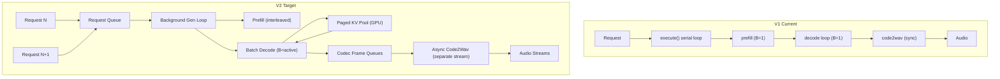
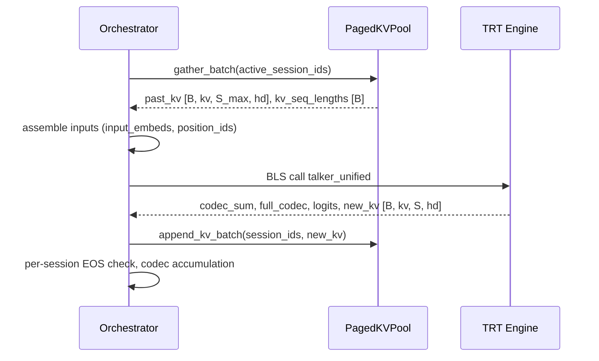
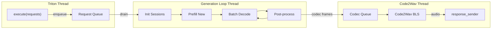
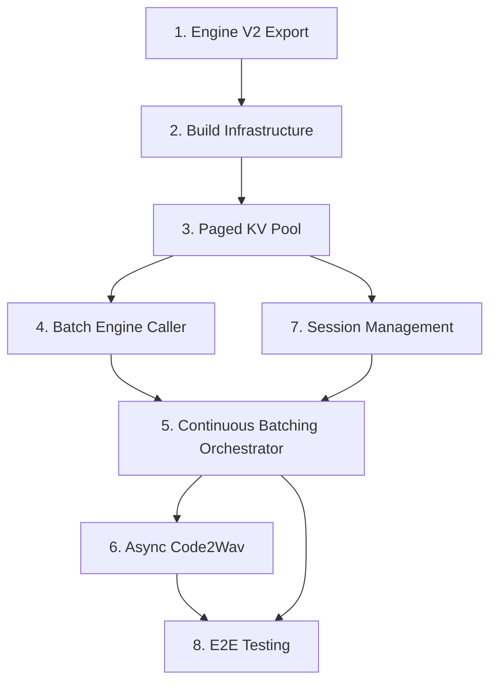

# V2: Paged KV Cache + Continuous Batching 完整方案

## 架构对比




---

## 1. Engine V2 导出 (export_04 重构)

**目标**: 新增 `kv_seq_lengths` 输入以支持不同 KV 长度的 batch decode；输出从 `present_kv` (full) 改为 `new_kv` (仅当前 step)。

**文件**: `[scripts/export/export_04_talker_unified.py](scripts/export/export_04_talker_unified.py)`

### 1.1 UnifiedKVCacheV2

替换现有 `UnifiedKVCache`，额外追踪每层的 new KV：

```python
class UnifiedKVCacheV2:
    def update(self, key_states, value_states, layer_idx, ...):
        past_k, past_v = self._past[layer_idx]
        full_k = torch.cat([past_k, key_states], dim=2)
        full_v = torch.cat([past_v, value_states], dim=2)
        self._past[layer_idx] = (full_k, full_v)
        self._new[layer_idx] = (key_states, value_states)  # Track new only
        return full_k, full_v

    def get_new(self, layer_idx):
        return self._new[layer_idx]
```

### 1.2 TalkerUnifiedONNX V2

关键变更：

- **新增输入** `kv_seq_lengths` [B] (INT64)：每个 batch item 的实际 KV 长度
- **Causal mask 重写**：支持 left-padded KV 的 per-batch 遮罩

```python
def _build_causal_mask_v2(self, S, S_past_max, kv_seq_lengths, B, device, dtype):
    S_total = S_past_max + S
    padding_offset = (S_past_max - kv_seq_lengths).view(B, 1, 1)
    col_idx = torch.arange(S_total, device=device).view(1, 1, -1)
    row_boundary = S_past_max + torch.arange(S, device=device).view(1, -1, 1)
    mask = torch.where(
        (col_idx < padding_offset) | (col_idx > row_boundary),
        torch.tensor(float('-inf'), dtype=dtype, device=device),
        torch.tensor(0.0, dtype=dtype, device=device),
    )
    return mask.unsqueeze(1)  # [B, 1, S, S_total]
```

- **输出变更**：`present_kv_{i}_k/v` → `new_kv_{i}_k/v`，shape 从 `[B, kv, S_total, hd]` 缩小为 `[B, kv, S, hd]`

### 1.3 Engine V2 I/O 一览

```
Inputs:                                    Outputs:
  input_embeds  [B, S, H]                   codec_sum   [B, 1, H]
  position_ids  [3, B, S]                   full_codec  [B, 16]
  kv_seq_lengths [B]          ← NEW         hidden      [B, S, H]
  past_kv_{i}_k [B, kv, S_past_max, hd]    logits      [B, S, V]
  past_kv_{i}_v [B, kv, S_past_max, hd]    new_kv_{i}_k [B, kv, S, hd]  ← CHANGED
                                            new_kv_{i}_v [B, kv, S, hd]  ← CHANGED
```

### 1.4 RoPE 正确性

position_ids 已有 B 维度 [3, B, S]，每个 batch item 可设不同 position。RoPE 编码进 K 值后，left-padding 不影响相对位置计算，因为 RoPE 基于绝对 position 而非 tensor 索引。

### 1.5 ONNX 可追踪性

mask 计算全部是 `torch.arange` + broadcast comparison + `torch.where`，均可被 PyTorch ONNX exporter 正确追踪为 ONNX 算子。`kv_seq_lengths` 作为输入 tensor，其上的运算在导出时不会被折叠为常量。

---

## 2. 构建基础设施更新

### 2.1 build_engines.sh

**文件**: `[scripts/bash/build_engines.sh](scripts/bash/build_engines.sh)`

trtexec shapes 变更：

- **新增输入**: `kv_seq_lengths` — min: `1`, opt: `1`, max: `MAX_BATCH_SIZE`
- **输出 KV**: max shape 从 `[B, kv, MAX_SEQ_LEN, hd]` 减小为 `[B, kv, MAX_INPUT_LEN, hd]`（decode 时 S=1，prefill 时 S=MAX_INPUT_LEN）
- **I/O formats**: 新增 `kv_seq_lengths` 的 `int64:chw`

### 2.2 triton.sh config.pbtxt

**文件**: `[scripts/bash/lib/triton.sh](scripts/bash/lib/triton.sh)` 中 `_write_talker_unified_bf16_config()`

- 新增 `kv_seq_lengths` input 定义
- 输出名从 `present_kv_{i}_k/v` 改为 `new_kv_{i}_k/v`

---

## 3. Paged KV Pool

**新文件**: `model_repository/tts_orchestrator/1/paged_kv_pool.py`

### 3.1 核心数据结构

```python
class PagedKVPool:
    def __init__(self, num_pages, block_size, num_layers, kv_heads, head_dim, dtype, device):
        # Pre-allocated GPU pool
        # shape: [num_pages, num_layers * 2, kv_heads, block_size, head_dim]
        self.pool = torch.zeros(...)
        self.block_size = block_size  # e.g. 32 tokens per page
        self.free_pages = deque(range(num_pages))

    # Per-session page table
    # session_id → PageTable(page_ids: List[int], seq_len: int)
```

### 3.2 关键操作


| 操作                              | 描述                                                                               | 复杂度                  |
| ------------------------------- | -------------------------------------------------------------------------------- | -------------------- |
| `allocate(session_id)`          | 分配初始页（prefill 后写入）                                                               | O(num_pages_needed)  |
| `append_kv(session_id, new_kv)` | 追加 new KV 到最后一页；页满则分配新页                                                          | O(1) per layer       |
| `gather_batch(session_ids)`     | 收集多 session 的 KV，left-pad 对齐，返回 `[B, kv, S_past_max, hd]` + `kv_seq_lengths [B]` | O(B * S_max)         |
| `release(session_id)`           | 释放 session 所有页回池                                                                 | O(pages_per_session) |
| `memory_stats()`                | 已用/空闲页数、显存占用                                                                     | O(1)                 |


### 3.3 显存预算计算

```
每页显存 = block_size × num_layers × 2(K/V) × kv_heads × head_dim × 2B(BF16)
         = 32 × 28 × 2 × 8 × 128 × 2 = 7.34 MB/page

设 KV 预算 = 2 GB → num_pages = 2048/7.34 ≈ 279 pages
每 session 平均 500 steps → 500/32 ≈ 16 pages/session
279 / 16 ≈ 17 路并发 (平均情况)

短句 200 steps → 7 pages → 279/7 ≈ 39 路并发
长句 1000 steps → 32 pages → 279/32 ≈ 8 路并发
```

### 3.4 gather 性能估算

gather 操作本质是 `index_select` + `copy_`，纯 HBM 带宽操作：

- 8 路 batch，平均 S_past=500：读取 8 × 57MB ≈ 456 MB
- RTX 4090 HBM 1 TB/s → ~0.46 ms
- 占单步总耗时 (2.8ms) 的 ~16%，可接受

---

## 4. Batch Engine Caller

**新文件**: `model_repository/tts_orchestrator/1/batch_engine.py`

封装 batch 推理的完整流程：




关键方法：

- `batch_decode(sessions) → Dict[session_id, StepResult]`：组装 batch → 调用 engine → 拆解结果
- `single_prefill(session) → PrefillResult`：单 session prefill → 写入 page pool

---

## 5. Continuous Batching Orchestrator

**重写**: `[model_repository/tts_orchestrator/1/model.py](model_repository/tts_orchestrator/1/model.py)`

### 5.1 架构模式




### 5.2 Generation Loop 主循环

```python
def _generation_loop(self):
    while self._running:
        # 1. Drain request queue → create sessions
        self._accept_new_requests()

        # 2. Prefill new sessions (one at a time, interleaved)
        pending = self.session_mgr.get_pending_prefill()
        if pending:
            session = pending[0]
            self._do_prefill(session)  # writes KV to page pool
            session.flow_state = FlowState.GENERATING

        # 3. Batch decode all GENERATING sessions
        active = self.session_mgr.get_active_generating()
        if active:
            results = self.batch_engine.batch_decode(active)
            for session in active:
                self._process_decode_result(session, results[session.session_id])

        # 4. Cleanup completed sessions
        self._cleanup_done_sessions()

        # 5. If nothing to do, short sleep to avoid busy-waiting
        if not active and not pending:
            time.sleep(0.001)
```

### 5.3 Prefill/Decode 交错 (策略 A)

每轮循环最多处理 1 个 prefill：

- Prefill 耗时 ~20ms (S≈100)，相当于 ~5 个 decode step 的间隔
- 对正在 decode 的 session：每来一个新请求增加 ~20ms 间歇延迟
- 权衡：新请求首包延迟 vs 现有 session 的生成连续性

### 5.4 execute() 改造

```python
def execute(self, requests):
    for request in requests:
        response_sender = request.get_response_sender()
        try:
            self._request_queue.put((request, response_sender))
        except Exception as e:
            self._send_error(response_sender, str(e))
            response_sender.send(flags=pb_utils.TRITONSERVER_RESPONSE_COMPLETE_FINAL)
    return None  # Return immediately, generation loop handles async
```

---

## 6. 异步 Code2Wav

### 6.1 设计

- 每个 session 维护一个 `codec_frame_queue`
- 当积累到 `chunk_threshold` 帧时，将 codec frames 入队到全局 `code2wav_queue`
- 独立的 Code2Wav 工作线程从队列取任务，调用 BLS code2wav，通过 `response_sender` 发送音频
- 使用独立 CUDA stream 避免和 decode 争抢

### 6.2 数据流

```python
@dataclass
class Code2WavTask:
    session_id: str
    codec_frames: torch.Tensor  # [T, 16]
    response_sender: ResponseSender
    is_final: bool
```

### 6.3 优先级

- `is_final=True` 的任务优先处理（确保最后一个 chunk 不被延迟）
- 首包 (first_chunk) 可以使用更小的 `chunk_threshold` 降低首包延迟

---

## 7. Session 管理增强

**文件**: `[model_repository/tts_orchestrator/1/session_manager.py](model_repository/tts_orchestrator/1/session_manager.py)`

### 7.1 TTSSession 扩展

```python
@dataclass
class TTSSession:
    # ... existing fields ...
    page_ids: List[int] = field(default_factory=list)  # PagedKVPool page references
    kv_seq_len: int = 0  # Actual KV sequence length
    codec_frame_queue: List[torch.Tensor] = field(default_factory=list)
    response_sender: Any = None  # For async audio delivery
    first_chunk_sent: bool = False
```

### 7.2 BatchScheduler 集成

- `allocate_slot()` 联动 `PagedKVPool` 检查是否有足够空闲页
- `release_slot()` 联动 `PagedKVPool.release()` 归还页
- Slot eviction 策略：优先驱逐最久 PAUSED 的 session

---

## 8. 文件变更清单


| 文件                                                       | 操作  | 说明                                 |
| -------------------------------------------------------- | --- | ---------------------------------- |
| `scripts/export/export_04_talker_unified.py`             | 重构  | Engine V2: kv_seq_lengths + new_kv |
| `scripts/bash/build_engines.sh`                          | 修改  | trtexec shapes 更新                  |
| `scripts/bash/lib/triton.sh`                             | 修改  | config.pbtxt 新 I/O                 |
| `model_repository/tts_orchestrator/1/model.py`           | 重写  | Continuous batching orchestrator   |
| `model_repository/tts_orchestrator/1/session_manager.py` | 增强  | 集成 PagedKVPool + 完善生命周期            |
| `model_repository/tts_orchestrator/1/paged_kv_pool.py`   | 新建  | GPU 页式 KV 池                        |
| `model_repository/tts_orchestrator/1/batch_engine.py`    | 新建  | Batch 推理封装 (gather/scatter)        |
| `docs/architecture.md`                                   | 更新  | V2 架构段落                            |


## 9. 实施顺序与依赖




Phase 1 (Engine V2 + Build) 完成后即可验证新 engine；
Phase 2 (Pool + Batch + Orchestrator) 是核心重构；
Phase 3 (Async Code2Wav + Testing) 是完善。