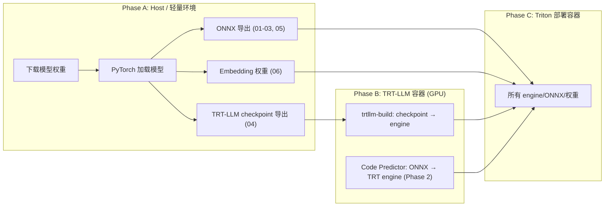

# 构建流程容器化方案

## 问题

当前 `autorun.sh` 在 host 裸机上通过 conda/venv 管理依赖，但 TRT-LLM engine 编译需要：

- TRT-LLM 运行时 (依赖链: TensorRT 10.x + cuDNN + NCCL + OpenMPI + CUDA toolkit)
- 与目标部署 GPU 匹配的 CUDA 版本
- `pip install tensorrt_llm` 会拉入特定版本的 PyTorch，极易破坏现有环境

Host 上直接 `pip install tensorrt_llm` 不可行：版本绑定太紧、依赖链太重、容易破坏 PyTorch 环境。

## 关键认知

构建流程天然分为两个阶段，对环境的要求不同：




- **Phase A** 只需要 PyTorch + qwen_tts + ONNX 工具，不需要 TRT-LLM — 当前 `autorun.sh` 已覆盖
- **Phase B** 只需要 TRT-LLM (trtllm-build CLI) + checkpoint 文件，不需要 PyTorch/qwen_tts
- **Phase C** 只需要 Triton + engine 文件，不需要任何构建工具

## 三种方案对比

### 方案 A: 拆分构建脚本 (推荐)

`autorun.sh` 只做 Phase A（ONNX + checkpoint 导出），新增 `build_engines.sh` 通过 `docker run` 调用 TRT-LLM 容器做 Phase B。

- 优点: 改动最小，职责清晰，灵活（可单独重跑 engine 编译），host 无需装 TRT-LLM
- 优点: checkpoint 导出和 engine 编译解耦 — 改参数（batch size 等）只需重跑 Phase B
- 优点: 可以用不同版本的 TRT-LLM 容器编译 engine，不影响 Phase A
- 缺点: 用户需要两步操作（`autorun.sh` → `build_engines.sh`）

```
autorun.sh (host)          →  workspace/exported/<variant>/trtllm_checkpoint/
build_engines.sh (docker)  →  workspace/exported/<variant>/trtllm_engine/
```

### 方案 B: 多阶段 Docker 构建

一个 Dockerfile，Stage 1 (TRT-LLM 基础镜像) 做全部导出 + engine 编译，Stage 2 (Triton 镜像) 只复制产物。

- 优点: 一条 `docker build` 全搞定，CI/CD 友好
- 缺点: 构建镜像巨大 (TRT-LLM 镜像 ~15GB+)，构建时间长
- 缺点: 改参数需要重新 build 整个镜像
- 缺点: 模型权重要 COPY 进镜像或用 buildkit mount，磁盘占用翻倍
- 缺点: 当前 autorun.sh 的 venv/mirror/交互选择逻辑不适合 Dockerfile 环境

### 方案 C: 构建容器

提供 `Dockerfile.build`，用户在该容器内运行 `autorun.sh`。

- 优点: 环境一致性好
- 缺点: autorun.sh 的 conda/venv 逻辑在容器内多余（容器已预装依赖）
- 缺点: TRT-LLM 容器 ~15GB+，用户下载/管理成本高
- 缺点: 模型权重需要 volume mount，交互式选择不友好

## 推荐: 方案 A (拆分构建)

这是当前架构下最自然的解决方案：

- `autorun.sh` **去掉** `install_trtllm_deps` 和 engine build，只做到 checkpoint 导出为止
- 新增 `scripts/bash/build_engines.sh`，通过 `docker run --gpus all` 调用 NGC TRT-LLM 容器执行 `trtllm-build`
- `export_04_talker_backbone.py` 的 `build_engine` 默认改为 `False`（checkpoint-only），engine build 由 shell 脚本在容器内完成
- 后续 Code Predictor 的 ONNX → TRT 编译也走同样的容器路径

### build_engines.sh 核心逻辑

```bash
# 用 NGC TRT-LLM 镜像编译 engine
# workspace/ 通过 volume mount 传入传出
docker run --rm --gpus all \
    -v "${REPO_ROOT}/workspace:/workspace" \
    nvcr.io/nvidia/tritonserver:xx.xx-trtllm-python-py3 \
    trtllm-build \
        --checkpoint_dir /workspace/exported/<variant>/trtllm_checkpoint \
        --output_dir /workspace/exported/<variant>/trtllm_engine \
        --gemm_plugin bfloat16 \
        --gpt_attention_plugin bfloat16 \
        --max_batch_size 8 \
        --max_input_len 512 \
        --max_seq_len 4096 \
        --paged_kv_cache disable
```

### 变更清单

- [scripts/bash/lib/pip.sh](scripts/bash/lib/pip.sh): 删除 `install_trtllm_deps()`，只保留 `safetensors` 安装（checkpoint 写入需要）
- [scripts/bash/autorun.sh](scripts/bash/autorun.sh): Step 8 去掉 TRT-LLM 安装，恢复为只安装 ONNX 导出依赖
- [scripts/export/export_04_talker_backbone.py](scripts/export/export_04_talker_backbone.py): `build_engine` 默认改 `False`；删除 `_build_trtllm_engine()` 函数（engine build 移到 shell 脚本）
- [scripts/export/export_all.py](scripts/export/export_all.py): 去掉 engine build 相关参数
- 新增 [scripts/bash/build_engines.sh](scripts/bash/build_engines.sh): 通过 docker run 调用 TRT-LLM 容器编译 engine
- [scripts/bash/export_models.sh](scripts/bash/export_models.sh): 恢复为纯 ONNX + checkpoint 导出
- 文档更新: architecture.md、project.mdc 中补充两步构建流程说明

