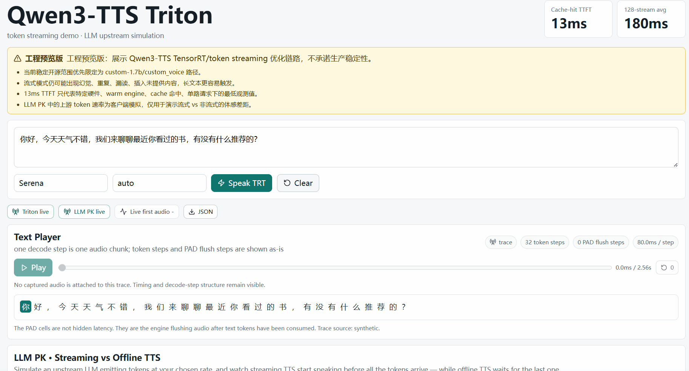
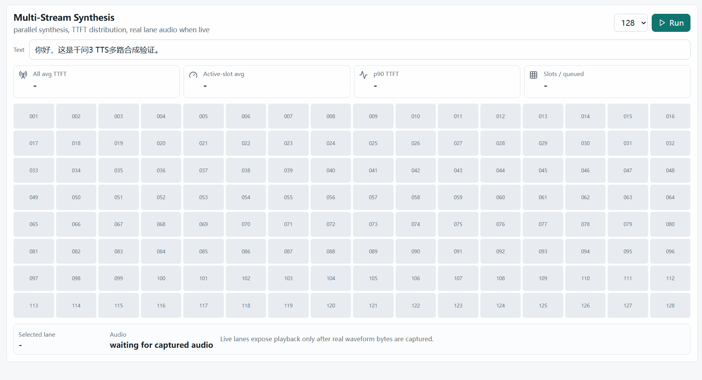

# Qwen3-TTS Triton

*让我们像播放音频一样播放文本！*

## 引言

Qwen3-TTS Triton 是一个 **工程预览版** 项目：把官方 Qwen3-TTS PyTorch 权重导出为 ONNX/TensorRT 运行时，并围绕 Triton/standalone engine 做 token 级流式 TTS、模型 fuse、前端分词、prefix cache、连续批处理和 WebUI 性能展示。

这个项目的目标不是把所有 Qwen3-TTS 官方路径一次性包装成生产服务，而是开放一条已经高度优化、可复现、可继续验证的工程链路，让社区能一起把它打磨成可靠的开源推理系统。

## 当前定位

**请先读这一段。**

- 当前建议的 v0.1 稳定范围是 `custom-1.7b` / `custom_voice` 路径。
- `design-1.7b` / `voice_design` 处于实验状态：代码里已有部分路径，但不应当对外承诺完全测通。
- `base` 语音克隆和 ICL 语音克隆仍是计划项：prefill/任务类型里能看到分支，但 standalone 引擎还没有完整打通 ref audio preprocessing、spk embedding/ref codes 注入和端到端验证。
- 流式模式仍可能出现幻觉、重复、漏读、插入未提供内容、长文本不稳定等问题。请把当前版本当作工程预览或研究预览，不要直接用于生产内容生成。
- README、WebUI 和 benchmark 会优先使用中文说明。中文口径稳定后再整理英文版。

## 性能声明

项目里提到的低延迟数字是有条件结果，不是通用承诺：

- `13ms TTFT`：最低观测值，依赖指定硬件、warm engine、prefix/cache 命中、单路请求、特定 engine profile 和本地链路。
- standalone `engine-grpc` TTFT 默认按 ready/reused gRPC channel 统计，和 WebSocket 一样不把客户端建连成本计入模型/服务首包延迟；如果使用 cold/lazy gRPC channel，新建 HTTP/2 连接的成本会让单次 TTFT 额外增加约 10ms。
- `180ms 128-stream avg TTFT`：并发压测口径，需要明确硬件、cache、输入文本、profile、采样参数和客户端测量方式。
- WebUI 默认会在 live Triton/engine 不可用时展示提示 warning，但不会补 synthetic beep 音频。只有结果 source 标记为 `live_triton` 或 `live_engine_websocket` 且带 `audio` 字段时，才代表可回放的实时合成音频。

详细 benchmark 口径见 [docs/zh/benchmark_methodology.md](docs/zh/benchmark_methodology.md)。

## 能力状态

| 路径 | 当前状态 | 开源口径 |
| --- | --- | --- |
| `custom-1.7b` / `custom_voice` | 优先稳定 | v0.1 推荐路径，WebUI 和 demo 默认围绕它展示 |
| `design-1.7b` / `voice_design` | 实验 | 可保留代码和导出入口，但需要标注未充分测通 |
| `base-1.7b` / x-vector voice clone | 计划中 | 当前不应标为可用；需要 ref audio 预处理和端到端测试 |
| `icl` voice clone | 计划中 | 当前不应标为可用；需要 ref audio/ref text/code 注入链路 |
| `0.6b` variants | 未作为 v0.1 主线 | 可保留导出/下载入口，发布前需要单独验证 |

## 快速开始

```bash
git clone --recursive https://github.com/user/Qwen3-TTS-Triton.git
cd Qwen3-TTS-Triton

# 推荐先跑 custom-1.7b；不带参数时会进入交互模式
bash scripts/bash/autorun.sh

# 一次性跑完整流程
bash scripts/bash/autorun.sh all -m custom-1.7b
```

三阶段流程：

```text
Phase A: setup_env.sh
  下载模型、安装环境、导出 ONNX/weights/manifest

Phase B: build_engines.sh
  在 NGC 容器里用 trtexec 编译 TensorRT engine，并把 engine profile 写回 triton_manifest.json

Phase C: deploy.sh / compose.sh
  以 standalone engine、engine Docker 或 Triton gateway 启动服务
```

## 统一入口与控制参数

`scripts/bash/autorun.sh` 是推荐的统一入口。它同时支持两种方式：

- 交互式：`bash scripts/bash/autorun.sh`
- 一次性调用：`bash scripts/bash/autorun.sh <command> [variant] [options]`

底层的 `setup_env.sh`、`build_engines.sh`、`deploy.sh`、`compose.sh` 仍可单独使用，但 README 默认只展示 `autorun.sh`。所有关键控制项都可以从 `autorun.sh` 进入：导出 GPU、TensorRT 编译 GPU、engine profile、runtime 上限、部署方式和端口。

配置优先级是：命令行参数 > 已导出的环境变量 > manifest/default。常用环境变量包括 `EXPORT_DEVICE`、`BUILD_GPU_DEVICE`、`RUNTIME_GPU_DEVICE`、`MAX_BATCH_SIZE`、`MAX_INPUT_LEN`、`MAX_SEQ_LEN`、`RUNTIME_MAX_BATCH_SIZE`、`RUNTIME_MAX_SEQ_LEN`；但推荐日常都从 `autorun.sh` 参数进入，便于复现。

### GPU 选择

默认 `--device auto`：脚本会选择当前空闲显存最多的 GPU。你也可以显式指定同一张卡用于所有阶段：

```bash
bash scripts/bash/autorun.sh all -m custom-1.7b --device 1
```

也可以按阶段拆开指定：

```bash
bash scripts/bash/autorun.sh all -m custom-1.7b \
  --export-device auto \
  --build-device 1 \
  --runtime-device 1
```

参数含义：

```text
--device <dev>          同时作用于导出、编译、运行阶段；dev 可为 auto、0、1、cuda:1
--export-device <dev>   仅 Phase A 导出模型使用；额外支持 cpu
--build-device <dev>    仅 Phase B trtexec 编译 engine 使用；支持 auto、all、0、1、cuda:1
--runtime-device <dev>  仅 Phase C 服务运行使用；支持 auto、0、1、cuda:1
```

Phase B 会在 Docker 层限制构建 GPU，例如 `--build-device 1` 会使用类似 `docker run --gpus device=1 ...` 的方式运行 `trtexec`。因此 `trtexec` 日志里可能显示容器内 `Selected Device ID: 0`，但 UUID 会对应物理 GPU 1。

### Engine Profile

TensorRT engine profile 由 Phase B 决定：

```bash
bash scripts/bash/autorun.sh build -m custom-1.7b \
  --max-batch-size 64 \
  --max-input-len 128 \
  --max-seq-len 512 \
  --dtype bf16
```

如果不显式传 `--max-batch-size`、`--max-input-len`、`--max-seq-len`，Phase B 会根据选中的构建 GPU 总显存给一个保守建议值：

```text
约 24 GB GPU:  max_batch=16   max_input_len=96   max_seq_len=384
约 32 GB GPU:  max_batch=32   max_input_len=128  max_seq_len=512
约 48 GB GPU:  max_batch=64   max_input_len=128  max_seq_len=512
约 80 GB GPU:  max_batch=128  max_input_len=128  max_seq_len=512
```

这只是默认建议，不是限制。比如你可以在 24G 机器上为 48G 部署机尝试构建更大的 profile：

```bash
bash scripts/bash/autorun.sh build -m custom-1.7b \
  --build-device 1 \
  --max-batch-size 64 \
  --max-input-len 128 \
  --max-seq-len 512
```

但 TensorRT 编译本身也需要显存。如果构建机显存不足，`trtexec` 仍可能 OOM；这时需要换更大构建卡、释放显存，或降低 profile。

这些值会写入 `workspace/exported/<variant>/triton_manifest.json` 的 `engine_profile` 字段。runtime 启动时如果请求的 batch/seq 超过 profile，会直接报错；prefill 长度超过 `max_input_len` 时也会报出明确错误，避免 silent clamp 或运行时才暴露 TensorRT shape 问题。

常用参数：

```text
Phase B:
  --max-batch-size <N>          TensorRT profile 最大 batch
  --max-input-len <N>           prefill/input 最大 token 长度
  --max-seq-len <N>             KV cache 最大 sequence 长度
  --dtype bf16|fp16|fp32|fp8    TensorRT build precision
  --triton-io-float-dtype <T>   TensorRT/Triton float I/O dtype，默认等于 --dtype
  --target-driver <ver>         按部署机 NVIDIA driver 选择 NGC 镜像
  --build-device <dev>          trtexec 编译 GPU

Phase C:
  --gateway standalone|triton|engine-docker
  --engine-mode trt|onnx
  --runtime-max-batch-size <N>  runtime scheduler batch 上限
  --runtime-max-seq-len <N>     runtime scheduler seq 上限
  --runtime-device <dev>        runtime 服务 GPU
```

示例：

```bash
# 构建较小 profile，便于低显存机器验证
bash scripts/bash/autorun.sh build -m custom-1.7b \
  --max-batch-size 16 --max-input-len 96 --max-seq-len 384

# runtime 使用不得超过 manifest 里记录的 profile
bash scripts/bash/autorun.sh deploy -m custom-1.7b \
  --gateway standalone \
  --runtime-max-batch-size 16 \
  --runtime-max-seq-len 384

# Triton gateway 也走同一套 runtime 上限和 GPU 入口
bash scripts/bash/autorun.sh deploy -m custom-1.7b \
  --gateway triton \
  --runtime-device 1 \
  --runtime-max-batch-size 16 \
  --runtime-max-seq-len 384
```

## 部署方式

### Standalone

本机 Python 运行 `engine.server`，适合调试 engine、协议和 WebSocket/gRPC。
启动前会组装同一个 `workspace/model_repository/tts_orchestrator/1`
模型包，然后通过 `--model-package-dir` 读取 `runtime/`、`weights/`、
`tokenizer/` 和 manifest；不会再直接把 `workspace/models` 与
`workspace/exported/<variant>` 当作运行时输入。

```bash
bash scripts/bash/autorun.sh deploy -m custom-1.7b --gateway standalone
```

默认端口：

- gRPC: `localhost:50051`
- WebSocket: `ws://localhost:50052/v1/ws`
- HTTP capabilities: `http://localhost:50052/v1/capabilities`
- HTTP health: `http://localhost:8080/health`

### Engine Docker

独立 engine 容器也使用和 Triton 相同的模型包：
`workspace/model_repository/tts_orchestrator/1`。这个包由 Phase C assemble
生成，包含 `runtime/`、`weights/`、`tokenizer/` 和 manifest；engine 镜像只提供
运行时和 `/app/engine` 代码，不再直接挂载原始 `workspace/models` 或
`workspace/exported`。

```bash
bash scripts/bash/autorun.sh deploy -m custom-1.7b --gateway engine-docker
```

注意：`autorun.sh build` 是 Phase B 的 TensorRT engine 编译，不是重建
`Dockerfile.engine` 对应的 Docker 镜像。`autorun.sh deploy --gateway engine-docker`
只会在镜像不存在，或镜像明显不是 engine 镜像时自动构建；如果你更新了
`engine/`、`engine.yaml` 或 `scripts/compose/engine-entrypoint.sh` 这类会被
`Dockerfile.engine` `COPY` 进镜像的文件，需要显式重新构建并重建容器：

```bash
bash scripts/bash/compose.sh down --gateway engine

DOCKER_BUILDKIT=1 bash scripts/bash/compose.sh up \
  --gateway engine \
  --variant custom-1.7b \
  --build

bash scripts/bash/compose.sh logs --gateway engine --follow
```

如果想继续走 `autorun.sh deploy`，可以先删除旧镜像，让 deploy 阶段重新构建：

```bash
bash scripts/bash/autorun.sh stop
docker image rm qwen3-engine:26.02
bash scripts/bash/autorun.sh deploy -m custom-1.7b --gateway engine-docker
```

如果你正在频繁改 engine 代码，不建议反复重建镜像。使用 compose 的开发覆盖层或 watch：

```bash
# 代码以 bind mount 方式进入容器，适合开发
bash scripts/bash/compose.sh up --gateway engine --variant custom-1.7b --dev

# 或使用 Docker Compose watch，同步代码并重启服务
bash scripts/bash/compose.sh watch --gateway engine --variant custom-1.7b
```

长期部署时可以使用普通镜像；开发期用 `--dev`/`watch`，把“环境层”和“代码层”分开。
engine-docker 当前要求模型包为 `--engine-mode trt`，因为 `engine.server`
消费的是 `runtime/model.plan`；Triton 仍可用同一包结构跑 `trt` 或 `onnx`。

### Triton

组装同一个 `workspace/model_repository` 并启动 Triton：

```bash
bash scripts/bash/autorun.sh deploy -m custom-1.7b --gateway triton --engine-mode trt
```

高级调试时可以直接使用 compose：

```bash
bash scripts/bash/compose.sh prepare --gateway triton --variant custom-1.7b --engine-mode trt
bash scripts/bash/compose.sh up --gateway triton --variant custom-1.7b
```

## 测试与验收

测试入口已经统一到 `tests/`，详细地图见 [tests/README.md](tests/README.md)。

日常开发建议先跑 unit + integration：

```bash
pytest tests/unit tests/integration -q
```

服务级 E2E 分两类：

```bash
# Standalone engine，服务未启动时 pytest 会自动 skip
python -m engine.server --config engine.yaml
pytest tests/e2e/test_engine_standalone.py -v -s

# Triton orchestrator，服务未启动时 pytest 会自动 skip
bash scripts/bash/build_triton.sh run
pytest tests/e2e/test_e2e.py -v -s
```

完整 serving 验收、音频生成和 benchmark 不再散落在 `scripts/python/` 或 `tests/e2e/test_*.py` 里，统一放在 `tests/tools/`：

```bash
mamba run -n qwen3-tts python tests/tools/serving_endpoints.py --help
mamba run -n qwen3-tts python tests/tools/serving_endpoints.py --targets engine-grpc
mamba run -n qwen3-tts python tests/tools/serving_endpoints.py --targets triton-grpc,triton-http
```

裸 engine TTFT 分布 benchmark：

```bash
mamba run -n qwen3-tts python tests/tools/serving_endpoints.py \
  --targets engine-grpc \
  --skip-single --skip-streaming --skip-custom-instruct \
  --skip-concurrent --skip-long --skip-badcase \
  --ttft-warmup 3 \
  --ttft-samples 30
```

`engine-grpc` TTFT 的 gRPC 连接口径由 `--ttft-grpc-connection` 控制：

```text
reuse  默认口径；复用一个 ready gRPC channel，推荐用于观察稳态 engine/server 首包延迟。
ready  每次请求新建并预热一个 ready channel，建连/预热不计入 TTFT。
cold   兼容旧口径；每次请求新建 lazy channel，TTFT 包含 gRPC/HTTP2 建连成本。
```

如果要复现旧的 `20ms+` gRPC cold-channel 数字，需要显式指定：

```bash
mamba run -n qwen3-tts python tests/tools/serving_endpoints.py \
  --targets engine-grpc \
  --skip-single --skip-streaming --skip-custom-instruct \
  --skip-concurrent --skip-long --skip-badcase \
  --ttft-warmup 3 \
  --ttft-samples 30 \
  --ttft-grpc-connection cold
```

## WebUI Demo

WebUI 分为三个工程展示板块：

- `Text Player`：把文本按 engine decode step 播放出来。一个音频 chunk 对应一个 step；前半段是 text token，进入 flush 后会直接显示 `PAD` step，不隐藏模型真实工作过程。合成完成后 slider 会 seek 实际 WAV 音频。
- `LLM PK`：模拟一个上游 LLM 按用户选择的速率（5–100ms / token）逐 token 吐字，把同一段文本同时喂给两套 TTS 接入。流式版本通过 Triton orchestrator 的 `init` + `append_text` × N + `text_complete` 把 token 增量推给引擎，引擎在第一个 token 到达后立刻开始合成；非流式版本在客户端把所有 token 攒齐后再用 `synthesize` 一次性发出。两栏共享同一时间轴和同一段 token tick，能直观看到流式版本的音频在上游 LLM 还没吐完就已经开播，而非流式版本要等"LLM 完成"竖线之后才出声。
- `Concurrency`：用短文本跑多路合成，统计 TTFT 分布和吞吐；默认请求 live Triton 并保存每路真实音频，点击 lane 可以回放该路合成结果。模拟并发只作为显式 fallback，不附带假音频。

### 演示预览

完整录屏：[演示视频.mp4](docs/videos/演示视频.mp4)

**Text Player**



**LLM PK**


**Concurrency**



首次体验建议用一键 demo 入口，WebUI dev server、Demo API 和 Triton 都由这个 launcher 启动/复用：

```bash
bash scripts/demo/start_webui_demo.sh --variant custom-1.7b
```

如果需要同时拉起裸 engine 容器用于对比，可以加 `--with-engine`：

```bash
bash scripts/demo/start_webui_demo.sh --variant custom-1.7b --with-engine
```

`LLM PK` 通过 Triton gRPC 调用 `tts_orchestrator`，和 `Speak TRT` / `Concurrency` 共用同一后端，不需要单独启动裸 engine。两次 PK 跑完后，trace/audio 都通过 `/api/v1/llm-pk` 一次性返回；不再写 fixture 文件，不需要单独的采集脚本。

WebUI demo 的 Triton active decode slots 默认按 128 路展示设置为 `TRITON_MAX_BATCH_SLOTS=128`。如果复用的是已经在跑的 Triton 容器，launcher 会读取该容器实际的 `MAX_BATCH_SLOTS`；比如容器仍是 64 slots，那么 128 路并发面板会明确显示 64 active / 64 queued，后 64 路 TTFT 会包含排队等待，不应解读为模型单路首包慢。

```bash
# 显式指定 Triton active decode slots
bash scripts/demo/start_webui_demo.sh --variant custom-1.7b --triton-slots 128
```

也可以从 WebUI 目录走 npm 脚本：

```bash
npm --prefix webui run demo -- --variant custom-1.7b
```

浏览器页面本身不能直接启动本机 Docker/Python 进程，因此自动启动逻辑放在本地 launcher 里。所有 WebUI 面板（LLM PK / Speak TRT / Concurrency）都走 Triton，所以默认只起 Triton 就够了。`--with-engine` 仍然保留作为可选项，用于把裸 engine 容器拉起来做对比，但 WebUI 不依赖它。

如果某个 live backend 不可用，WebUI 会展示对应 warning；音频按钮只会在该 backend 捕获到真实 waveform bytes 时启用，不再用嘟声占位。

多路合成默认走 live Triton。需要只看前端布局或离线演示指标时，可以显式关闭 live lane audio：

```bash
bash scripts/demo/start_webui_demo.sh --variant custom-1.7b --simulated-concurrency
```

```bash
# Terminal 1
python -m demo_api --host 0.0.0.0 --port 7860

# Terminal 2
cd webui
npm install
npm run dev
```

打开 `http://localhost:5173`。

Docker Compose demo profile：

```bash
bash scripts/bash/compose.sh up --gateway triton --variant custom-1.7b
docker compose --profile demo up --build demo-api webui
```

如果直接手动启动 Demo API，live concurrency 默认开启；需要模拟模式时显式设为 0：

```bash
QWEN_DEMO_ENABLE_LIVE_CONCURRENCY=0 python -m demo_api --port 7860
```

### Text Player 口径

`Text Player` 消费 engine/Triton 已有的 `text_token`、`first_audio_chunk`、`audio_chunk` 和 `segment_end` 事件。若 audio chunk 已带 `phase/token_idx/decode_step/chunk_ms` metadata，WebUI 直接使用逐 chunk metadata；否则用 `segment_end.meta.text_tokens` 和 `segment_end.meta.audio_steps` 构造 decode step：前 `text_tokens` 个 step 标记为 token，剩余 step 标记为 `PAD` flush。这个推导不会掩盖 flush。

Text Player 的 slider 和 inline token/PAD 都只 seek 已经生成的 WAV 音频，不向 engine 发起 rollback。精确“音频播放到哪个字/词”的语义后续仍建议接 streaming ASR 或 alignment 模型；这里展示的是 engine decode-step 工作过程。

## 流式协议

standalone engine 同时支持 gRPC 和 WebSocket。WebSocket 控制帧示例：

```json
{"type":"start","session_id":"demo","config":{"task_type":"custom_voice","speaker":"Serena"}}
{"type":"text","text":"你好，世界。"}
{"type":"end"}
```

服务端返回：

- JSON event frame：协议事件、文本 token、边界提交、完成事件等。
- Binary frame：PCM audio chunk，音频格式由 start/event 元数据声明。

## 项目结构

```text
Qwen3-TTS-Triton/
├── engine/                     # standalone engine、frontend、scheduler、TRT executor
├── demo_api/                   # WebUI demo API、fixture/live trace、音频回放
├── webui/                      # Vite/React WebUI
├── scripts/
│   ├── bash/                   # autorun/setup/build/deploy/compose 脚本
│   ├── export/                 # PyTorch -> ONNX/manifest 导出脚本
│   └── python/                 # manifest/config/profile 工具
├── docs/
│   ├── zh/                     # 中文优先文档
│   └── architecture.md
└── workspace/                  # 模型、导出产物、engine、trace；默认 gitignored
```

## 中文文档

- [已知限制与风险](docs/zh/known_limitations.md)
- [Benchmark 方法](docs/zh/benchmark_methodology.md)
- [部署说明](docs/zh/deployment.md)
- [路线图](docs/zh/roadmap.md)
- [架构说明](docs/architecture.md)

## 许可证

本项目基于 [Qwen3-TTS](https://github.com/QwenLM/Qwen3-TTS) 进行工程化部署与优化。模型权重和上游代码的许可证请以 QwenLM 官方仓库为准。
