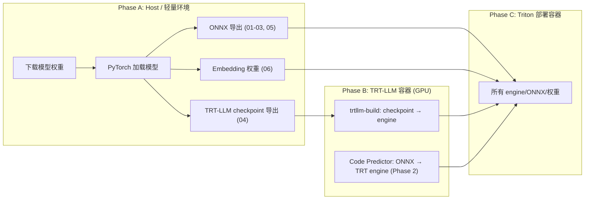

# Qwen3-TTS Triton 流式推理服务架构设计

> **技术路线**: Triton Inference Server + TensorRT (/ TRT-LLM) + ONNX Runtime
>
> **推理精度**: BF16 (BFloat16)。BF16 与 FP32 共享 8 位指数范围，彻底避免 FP16 在 RoPE / LayerNorm / Softmax 中的 overflow 风险，同时保持与 FP16 相同的显存占用和吞吐。
>
> **核心策略**: Talker Backbone → **TRT-LLM** (含 KV Cache，由 TRT-LLM 运行时管理)，Code Predictor → TRT (无 KV Cache，15 步循环展开为单引擎)，其余 → ONNX

---

## 1. 设计目标

| 目标 | 说明 |
|------|------|
| 自适应流式文本输入 | 默认 token 级消费，自动适应上游 LLM 速度，按需降级 |
| 帧级流式音频输出 | 每积累一定 codec frames 即合成并推送音频片段 |
| 多用户 Batch 推理 | 共享 GPU 资源，支持 continuous insert/complete |
| 高 GPU 利用率 | 推理引擎消除框架开销，GPU 利用率 > 80% |
| LLM 无关性 | 无论上游是大模型还是小模型，TTS 服务无需任何改动 |

---

## 2. 模型组件总览

从原始 `Qwen3TTSForConditionalGeneration` 中拆分出 6 个独立组件：

| 组件 | 模型结构 | 有效参数 | 推理引擎 | 调用模式 |
|------|---------|---------|---------|---------|
| **Text Embedder** | `Embedding(151936, 2048)` + `ResizeMLP(2048→1024)` | ~312M | PyTorch 权重 | 每请求 1 次 + 文本到达时 |
| **Speaker Encoder** | ECAPA-TDNN, mel=128, enc_dim=1024 | ~6M | ONNX | 每请求 1 次 (仅 voice clone) |
| **Speech Tokenizer Encoder** | MimiModel, 16 codebooks | ~26M | ONNX | 每请求 1 次 (仅 ICL 模式) |
| **Talker Backbone** | Qwen3-style, 28L, h=1024/2048 (0.6B/1.7B), GQA(16h/8kv), head_dim=128 | ~180M–500M | **TRT-LLM** | 每 decode step 1 次 (最热路径) |
| **Code Predictor** | Qwen3-style, 5L, h=1024, GQA(16h/8kv), head_dim=128 + 15×embed + 15×lm_head | ~200M | **TensorRT (单引擎, 15 步展开)** | 每 decode step 1 次调用 |
| **Code2Wav Decoder** | RVQ Dequant + Transformer(8L) + BigVGAN ConvNet | ~60M | ONNX | 每 chunk 1 次 |

### 2.1 Embedding 权重 (内置于 Orchestrator)

以下权重直接加载到 Orchestrator 进程中，不通过 Triton 模型调度：
- Talker 的 codec embedding (`Embedding(vocab, 1024)`)
- Talker 的 16 个 codec sum embedding (用于构造 decode step 输入)
- 特殊 embedding: `tts_pad_embed`, `tts_bos_embed`, `tts_eos_embed`
- Text Embedder: `Embedding(151936, 2048)` + `ResizeMLP(2048→1024)`, ~312M 参数, ~624MB BF16

> **显存规划**: Text Embedder 权重 (~624MB) 由 PyTorch 管理，不在 Triton memory pool 内。需在总显存预算中显式计入：
> - Text Embedder: ~624MB
> - Codec Embeddings (16 × Embedding): ~64MB
> - 特殊 Embeddings: <1MB
> - 合计 Orchestrator 占用: **~690MB**

> **Codec Embedding Sum 优化（已实现）**: 每个 decode step 需计算 `Σ embed_i(codec_ids[i]), i=0..15`。朴素实现为 16 次 Embedding.forward() + 逐元素加法（~0.15ms）。已实现预合并 3D 查找表方案：
> - Talker codec embedding vocab=3072，CP 15 个 embedding vocab=2048；CP 零填充至 3072 后与 Talker 堆叠为 `[16, 3072, H]`（H=talker_hidden_size），单次 advanced indexing + sum 完成
> - 导出见 `codec_embeddings_3d.pt`（export_06）；推理使用 `scripts/python/codec_embedding_sum.py` 的 `CodecEmbeddingSum` 模块
> - 实测（design-1.7b, GPU）：3D gather ~0.02ms，naive 循环 ~0.17ms，**约 7.7x 加速**；同 dtype 时与朴素实现 bitwise 一致，导出 BF16 时 max_abs_diff < 0.001

### 2.2 模型变体与任务类型

Qwen3-TTS 提供三个模型变体，**架构完全相同**（均为 `Qwen3TTSForConditionalGeneration`），仅权重不同：

| 变体 | tts_model_type | 核心能力 | 需要 Speaker Encoder | 需要 Speech Tokenizer | 需要 instruct |
|------|---------------|---------|---------------------|----------------------|--------------|
| **Base** | `base` | 3 秒声音克隆 (voice clone) | **是** (ref_audio → spk_embed) | ICL 模式: **是** | 否 |
| **CustomVoice** | `custom_voice` | 9 个预置音色 + 指令控制 | **否** (spk_id 查表) | 否 | 可选 (风格控制) |
| **VoiceDesign** | `voice_design` | 自然语言描述设计音色 | **否** (无 speaker) | 否 | **必需** (音色描述) |

#### 2.2.1 任务类型与子模式

```
TaskType
├── VOICE_CLONE         ← Base 模型
│   ├── ICL 模式        ← ref_audio + ref_text → Speaker Encoder + Speech Tokenizer
│   │                     prefill 含参考音频的 codec tokens，克隆质量最高
│   └── X_VECTOR_ONLY   ← ref_audio → Speaker Encoder (仅 spk embedding)
│                         不需要 ref_text，克隆质量略低但更简单
├── CUSTOM_VOICE        ← CustomVoice 模型
│   └── speaker (9选1) + 可选 instruct (风格/情感控制)
└── VOICE_DESIGN        ← VoiceDesign 模型
    └── instruct (必需, 描述目标音色)
```

#### 2.2.2 Speaker 来源差异

三种任务类型的 speaker embedding 来源完全不同，Orchestrator 必须按 task_type 分支处理：

| 任务类型 | speaker_embed 来源 | 值 |
|----------|-------------------|-----|
| Base (ICL / X_VECTOR) | Speaker Encoder ONNX 推理 | `extract_speaker_embedding(ref_audio)` → `[1, 1024]` |
| CustomVoice | Talker codec embedding 查表 | `codec_embed(spk_id[speaker_name])` → `[1, 1, 1024]` |
| VoiceDesign | 无 (None) | prefill 中不插入 speaker 位置 |

#### 2.2.3 部署策略: 单变体 vs 多变体

**推荐: 单变体部署** (Phase 1-3)

每个 Triton 实例加载**一套模型权重**，通过部署配置选择变体：

```
优点:
  - 显存零浪费 (Talker ~360MB + CP ~400MB + 其他 ~200MB ≈ 960MB)
  - 部署配置简单
  - 不同变体可独立扩缩容

缺点:
  - 需要多种音色功能时须部署多个实例

配置方式:
  model_repository/tts_orchestrator/config.pbtxt:
    parameters: {
      key: "model_variant"
      value: { string_value: "Qwen3-TTS-12Hz-1.7B-CustomVoice" }
    }
```

**备选: 多变体部署** (Phase 4+)

```
方案 A: 多 Orchestrator 实例 (推荐)
  - 同一 Triton 进程内注册多个 Orchestrator (tts_base / tts_custom / tts_design)
  - 共享 Talker/CP/Code2Wav 引擎 (架构相同)
  - 仅 Orchestrator 内的 spk_id 查表权重不同 (~几 KB)
  - ⚠️ 前提: 确认不同变体的 Talker/CP 权重差异可忽略 (待验证)

方案 B: Gateway 路由
  - Gateway 按 task_type 路由到不同 Triton 实例
  - 各实例独立加载不同权重
  - 适合异构部署 (不同 GPU 跑不同变体)
```

> **关键发现 (已验证)**: 三个变体的 Talker/CP Transformer 层权重高度相似 (cosine >0.994)，但 **codec embedding 差异显著** (cosine ~0.60)。由于 codec embedding 参与每步 decode 的输入构造，引擎**不可跨变体共享**，必须按单变体部署。详见 `workspace/exported/multi_variant_report.json`。

---

## 3. 整体架构

```
                      ┌─── 上游 Reply LLM ───┐
                      │  text stream (句级)   │
                      └──────────┬────────────┘
                                 │ gRPC BiDi Stream / WebSocket
                                 ▼
┌──────────────────────────────────────────────────────────────────┐
│                     TTS Gateway (gRPC ↔ Triton)                  │
│  - 自定义 gRPC TTSService (见 12.3)                               │
│  - 协议转换: TTSRequest/Response ↔ Triton InferenceRequest       │
│  - 会话路由: session_id → Triton decoupled model request         │
│  - 客户端断连检测 + 取消传播                                       │
└──────────────────────┬───────────────────────────────────────────┘
                       │ Triton gRPC (tritonclient)
                       ▼
┌─────────────────────────────────────────────────────────────┐
│                   Triton Inference Server                    │
│                                                             │
│  ┌───────────────────────────────────────────────────────┐  │
│  │         TTS Orchestrator (BLS Python Backend)         │  │
│  │                                                       │  │
│  │  ┌─────────────┐  ┌──────────────────────────────┐   │  │
│  │  │ Session Mgr  │  │     Batch Scheduler          │   │  │
│  │  │ (per-user    │  │  - Slot allocation           │   │  │
│  │  │  state)      │  │  - Continuous insert/remove  │   │  │
│  │  └─────────────┘  │  - Prefill/Decode 调度        │   │  │
│  │                    │  - Talker KV cache mgmt      │   │  │
│  │  ┌─────────────┐  └──────────────────────────────┘   │  │
│  │  │ Flow Control │  自适应流控 (类 TCP 拥塞控制):       │  │
│  │  │ State Machine│  TOKEN → ADAPTIVE → SENTENCE(降级)  │  │
│  │  └─────────────┘                                     │  │
│  │                                                       │  │
│  │  ┌───────────────────────────────────────────────┐   │  │
│  │  │           Streaming Generation Loop            │   │  │
│  │  │                                                │   │  │
│  │  │  1. Talker Backbone (decode) → logits          │   │  │
│  │  │  2. Sample → codec_token_0                     │   │  │
│  │  │  3. Code Predictor (单次调用) → codec #1~#15   │   │  │
│  │  │  4. Accumulate → Code2Wav (异步) → audio       │   │  │
│  │  │  5. Construct next input → loop                │   │  │
│  │  └───────────────────────────────────────────────┘   │  │
│  └──┬────────┬────────┬────────┬────────┬───────────────┘  │
│     │        │        │        │        │                   │
│     ▼        ▼        ▼        ▼        ▼                   │
│  ┌──────┐┌──────┐┌──────┐┌──────────┐┌──────────────────┐  │
│  │ Text ││ Spk  ││Speech││ Talker   ││ Code Predictor   │  │
│  │Embed ││ Enc  ││Token ││ Backbone ││ (TRT 单引擎      │  │
│  │(Torch││(ONNX)││ Enc  ││(TRT-LLM) ││  15步展开,无KV)  │  │
│  │ Wts) ││      ││(ONNX)││ +KVCache ││ (fallback:15调用)│  │
│  └──────┘└──────┘└──────┘└──────────┘└──────────────────┘  │
│                                      ┌────────┐            │
│                                      │Code2Wav│            │
│                                      │ (ONNX) │            │
│                                      │ 异步stream│           │
│                                      └────────┘            │
└─────────────────────────────────────────────────────────────┘
                                 │
                                 │ audio chunk stream
                                 ▼
                           ┌──────────┐
                           │  Client  │
                           └──────────┘
```

### 3.1 TTS Gateway

Triton 有自己的 gRPC 协议 (`tritonclient`)，与自定义的 `TTSService` proto 不兼容。需要一个 **Gateway 进程** 做协议桥接：

| 职责 | 说明 |
|------|------|
| 协议转换 | 外部 `TTSRequest` ↔ Triton `InferenceRequest` (decoupled model) |
| 流式桥接 | 客户端 gRPC BiDi stream ↔ Triton 多次 partial response |
| 断连传播 | 客户端断开时通知 Orchestrator 释放 slot |
| 负载均衡 | 多 Triton 实例时做请求路由 (Phase 4) |

> **替代方案**: 如果不需要自定义 proto，可直接使用 Triton 的 decoupled model + `tritonclient` 库。客户端直接用 Triton 协议通信，省去 Gateway 层。适用于内部服务间调用场景。

---

## 4. 核心数据流

### 4.1 完整生成流程 (单请求视角)

```
Phase 0: 初始化 (按 task_type 分支)
════════════════════════════════════

[共通] Tokenize: text → input_ids, instruct → instruct_ids (if any)
       Text Embedding: text_embed(ids) → text_proj(·) → [1, S, 1024]

[VOICE_CLONE — Base 模型]
     │
     ├── Speaker Encoder (ONNX):
     │   mel_spectrogram(ref_audio, sr=24000) → [1, T, 128]
     │   → spk_embedding [1, 1024]
     │
     └── Speech Tokenizer Encoder (ONNX, 仅 ICL 模式):
         ref_audio → ref_codes [T_ref, 16]
         (x_vector_only 模式跳过此步)

[CUSTOM_VOICE — CustomVoice 模型]
     │
     └── Speaker ID 查表 (Orchestrator 内):
         config.spk_id[speaker_name] → spk_id (int)
         codec_embed(spk_id) → speaker_embed [1, 1, 1024]
         (无 Speaker Encoder / Speech Tokenizer 调用)

[VOICE_DESIGN — VoiceDesign 模型]
     │
     └── 无 speaker 处理
         (speaker_embed = None, 音色由 instruct 隐式指定)


Phase 1: Prefill 构造 (按 task_type 分支)
══════════════════════════════════════════

所有任务类型共享的基础结构:
  role_embed = text_proj(text_embed(input_ids[:3]))    # <|im_start|>assistant\n
  tag_embed  = codec_embed([think_id, think_bos, lang_id?, think_eos])  # 3~4 tokens
  bos_embed  = codec_embed(codec_bos)
  text 层:  tts_pad × (tag_len-1) + tts_bos  对齐 codec 层
  每个位置 = text_proj + codec_embed (双轨叠加)

[CUSTOM_VOICE] instruct + speaker_id:
   ┌─────────────────────────────────────────────────────────────────────┐
   │ role (3) │ instruct_embed (S_ins) │ tag (3~4) │ spk (1) │ bos+t₀  │
   └─────────────────────────────────────────────────────────────────────┘
   instruct_embed = text_proj(text_embed(instruct_ids))
   spk = codec_embed(spk_id[speaker_name])  ← 从 config 查表, 非 Speaker Encoder

[VOICE_DESIGN] instruct, 无 speaker:
   ┌────────────────────────────────────────────────────────────────┐
   │ role (3) │ instruct_embed (S_ins) │ tag (3~4) │ bos+t₀       │
   └────────────────────────────────────────────────────────────────┘
   instruct_embed = text_proj(text_embed(instruct_ids))
   无 speaker 位置 (speaker_embed = None)

[VOICE_CLONE, x_vector_only] speaker_embed, 无 ICL:
   ┌──────────────────────────────────────────────────────┐
   │ role (3) │ tag (3~4) │ spk_embed (1) │ bos+t₀       │
   └──────────────────────────────────────────────────────┘
   spk_embed = Speaker Encoder(ref_audio) → [1, 1024]

[VOICE_CLONE, ICL] speaker_embed + ref_code:
   ┌───────────────────────────────────────────────────────────────────────────────┐
   │ role (3) │ tag (3~4) │ spk_embed (1) │ bos │ ref_text+ref_codec (T_ref) │ t… │
   └───────────────────────────────────────────────────────────────────────────────┘
   spk_embed = Speaker Encoder(ref_audio)
   ref_text_embed = text_proj(text_embed(ref_ids))  ← 参考文本 embedding
   ref_codec_embed = Σ codec_embed_i(ref_code[:, i])  ← 参考音频 codec embedding
   ICL 段: ref_text_embed + ref_codec_embed (双轨叠加, 类似 decode step)
   trailing_text_hidden 从 ICL 段尾部开始 (ref 文本后的生成文本)


1. 初始化 trailing_text_hidden 队列:
   - 非 ICL: text_proj(text_embed(input_ids[4:-5])) + tts_eos_embed
   - ICL: 由 generate_icl_prompt 内部切分 (见上)
   - 已到达的后续文本 → embed 后入队
   - 未到达的 → 后续动态追加 (token 级或句级, 取决于当前流控模式)

2. Talker Backbone Forward (Prefill, TRT-LLM):
   inputs_embeds [1, S_prefill, 1024]   ← S_prefill 因 task_type 而异
   → hidden_states [1, S_prefill, 1024]
   → logits [1, S_prefill, 3072]
   → KV Cache 初始化

3. past_hidden = hidden_states[:, -1:, :]


Phase 2: Decode Loop (流式)
═══════════════════════════
┌──────────────────────────────────────────────────────┐
│ while not EOS and step < max_tokens:                 │
│                                                      │
│   ① Sample codec_token_0 from logits (argmax/top-k)  │
│                                                      │
│   ② Code Predictor 单次调用 (TRT, 无 KV Cache):      │
│      输入: past_hidden [B,1,1024], codec_token_0 [B] │
│      内部: 15 stage 全量 prefill (循环展开)            │
│      输出: codec_ids [B, 15]                         │
│      全部 16 个 codebook: [codec_0, codec_ids]       │
│                                                      │
│   ③ Accumulate → Code2Wav (每 25 frames):            │
│      Code2Wav chunked_decode → audio chunk           │
│      → 流式推送到客户端                               │
│                                                      │
│   ④ 构造下一步 inputs_embeds (自适应流控):              │
│      codec_sum = Σ embed_i(codec_ids[i]) [B,1,1024]  │
│      text_add = 按流控策略选择:                        │
│        有文本 → trailing_text_hidden[step]            │
│        短暂缺失 → tts_pad_embed (容忍少量 pad)        │
│        持续缺失 → PAUSE decode (冻结 KV cache)        │
│      input = codec_sum + text_add                    │
│                                                      │
│   ⑤ Talker Backbone Forward (Decode, TRT-LLM):         │
│      inputs_embeds [B, 1, 1024] → logits, KV update  │
│      past_hidden = hidden_states                     │
│                                                      │
│   ⑥ step += 1                                        │
└──────────────────────────────────────────────────────┘


Phase 3: 收尾
═════════════
- Flush 剩余 codec tokens → Code2Wav → 最后一段音频
- 释放 Talker KV Cache slot
- 关闭 stream
```

### 4.2 自适应流式文本输入机制

复用原始模型的 streaming 模式 (`non_streaming_mode=False`)，**默认 token 级消费，按需自动降级**：

```
上游 LLM (快, 40 tok/s):
  token 级消费, 无等待:
  "你" 到达 → prefill, 开始 decode
  "好" 到达 → 立即消费为 trailing_text_hidden
  "世" 到达 → 立即消费
  ...无间断...

上游 LLM (中, 10 tok/s):
  text 偶尔跟不上 decode step:
  step 5: 文本还没到 → 插入 tts_pad_embed (1 个, pad_tolerance=1)
  step 6: 文本仍未到 → 连续第 2 个 pad → PAUSE, 冻结 KV cache
  step 6+: "界" 到达 → buffer ≥ resume_threshold → 恢复 decode
  → 频繁 PAUSE → 自动升级为 ADAPTIVE 模式 (增大启动缓冲)

上游 LLM (慢, 3 tok/s):
  频繁 starvation → 自动提升流控等级:
  TOKEN_LEVEL → ADAPTIVE (增大启动缓冲)
  → 仍然频繁 starvation → SENTENCE_LEVEL (降级, 输出警告)
```

**`tts_pad_embed` 的容忍度** (基于实验验证):

> **Pad 容忍度实验** (`scripts/python/pad_tolerance_experiment.py`):
> 原始 PyTorch 模型 (CustomVoice 1.7B)，句中插入 0/1/2/3/5 个 `tts_pad_token_id`，
> 中/英文各两次重复，对比音频质量：
>
> | Pad 数 | 中文音频时长变化 | 英文音频时长变化 | 音质观感 |
> |--------|-----------------|-----------------|---------|
> | 0 (基线) | — | — | 正常 |
> | 1 | +1.6% | +8% | 可接受，轻微节奏变化 |
> | **2** | **+9.5%** | **-1% ~ +0%** | **已出现可感知的停顿/拖音** |
> | 3 | +21% | +32% | 明显异常：时长膨胀、多余停顿 |
> | 5 | +20% | +47% | 严重退化：长拖音、节奏崩坏 |
>
> **结论**: pad=2 已存在质量风险；`pad_tolerance` 应设为 **1**（最多容忍 1 个连续 pad）。

- 模型训练时在多个场景使用 pad（codec tags 填充、ICL 对齐、non_streaming 全程 pad）
- 但这些训练场景中 pad 出现在**结构化位置**（序列头尾/对齐区），而非句中任意位置
- 句中插入 1 个 pad 仅相当于 "文本暂缺一步"，模型可从后续真实文本恢复
- 句中连续 ≥2 个 pad 开始偏离训练分布，产生可感知的停顿/拖音
- 超过容忍阈值时，PAUSE decode 保护音频质量（KV cache 不依赖 wall-clock 时间）

---

## 5. Code Predictor: 无 KV Cache 循环展开方案

这是本架构的关键优化。Code Predictor 的 15 步自回归**去掉 KV Cache**，每步从头做全量 prefill，15 步展开为**单一 TRT 引擎**的一次调用。

> **⚠️ TRT 编译风险**: 15 步展开的单引擎方案存在 TRT 编译层面的不确定性（详见 5.5 节），需在 Phase 1 优先验证。已准备 fallback 方案（5.6 节）。

### 5.1 方案对比

| 维度 | 传统 KV Cache 方案 | 无 KV Cache 展开方案 (首选) | 无 KV Cache 单 stage 方案 (fallback) |
|------|-------------------|--------------------|--------------------------------------|
| **TRT 导出难度** | 高（KV Cache 显式管理 + 循环 + 15 个 lm_head 切换） | **中（纯静态图，但 argmax→Gather 链路需验证）** | **低（单 stage，确定可行）** |
| **权重读取量** | 15 × 153MB = 2.30GB | 15 × 153MB = 2.30GB（**相同**） | 15 × 153MB = 2.30GB（**相同**） |
| **额外计算** | 无 | 前缀重算 ~0.12ms（**可忽略**） | 前缀重算 ~0.12ms（**可忽略**） |
| **Batch 效率** | GEMV [B,1,1024]×W（GPU 利用率低） | **GEMM [B,S,1024]×W（GPU 利用率高）** | **GEMM [B,S,1024]×W（GPU 利用率高）** |
| **性能 (B=1)** | ~2ms | ~2ms | ~3ms（+15 次 launch 开销） |
| **性能 (B=8)** | ~2ms | **~2ms（更好）** | ~3.5ms |
| **实现复杂度** | 需管理 CP 的 KV Cache | **无状态，单次 forward** | **无状态，但需 Python 循环 15 次** |

### 5.2 为什么额外计算可以忽略

Code Predictor: 5 层 Transformer，hidden=1024。

- 瓶颈是**权重读取**（memory bandwidth bound），不是计算
- 每步必须从 HBM 读取全部 153MB 权重，无论是否使用 KV Cache
- 前缀重算的激活值计算量: 5L × Σ(seq=2..16) × 30M FLOPs ≈ 20G FLOPs
- RTX 4090 BF16: 330 TFLOPS → 20G / 330T = **0.06ms**（vs 总耗时 ~2ms，占比 3%）

### 5.3 TRT 引擎结构

```
┌───────────────────────────────────────────────────────────┐
│            Code Predictor TRT Engine (单引擎)              │
│                                                           │
│  输入: past_hidden [B, 1, 1024]                           │
│        codec_token_0 [B]                                  │
│                                                           │
│  内部 (全部静态图, 无循环, 无外部状态):                       │
│                                                           │
│  ┌─ Stage 0 ──────────────────────────────────────────┐   │
│  │ seq = [past_hidden, embed_0(codec_0)]  → [B,2,D]  │   │
│  │ → projection → Transformer_5L → lm_head_0 → argmax│   │
│  │ → token_1                                          │   │
│  └────────────────────────────────────────────────────┘   │
│                         ↓ token_1                         │
│  ┌─ Stage 1 ──────────────────────────────────────────┐   │
│  │ seq = [..., embed_1(token_1)]  → [B,3,D]           │   │
│  │ → projection → Transformer_5L → lm_head_1 → argmax│   │
│  │ → token_2                                          │   │
│  └────────────────────────────────────────────────────┘   │
│                         ↓ token_2                         │
│  ...  (15 个 stage, 共享 Transformer 权重)                 │
│                                                           │
│  ┌─ Stage 14 ─────────────────────────────────────────┐   │
│  │ seq = [all 16 tokens]  → [B,16,D]                  │   │
│  │ → projection → Transformer_5L → lm_head_14 → argmax│  │
│  │ → token_15                                          │  │
│  └─────────────────────────────────────────────────────┘  │
│                                                           │
│  输出: codec_tokens [B, 15]                               │
└───────────────────────────────────────────────────────────┘

权重共享: 15 个 stage 引用同一组 Transformer 权重 (IConstantLayer)
         TRT 自动识别共享, 只存储一份, 优化 L2 cache 复用
```

### 5.4 导出代码

```python
class CodePredictorUnrolled(nn.Module):
    """15 步全部展开为单次 forward，无 KV Cache"""

    def __init__(self, transformer_layers, norm, rotary_emb,
                 projection, embeddings, lm_heads):
        super().__init__()
        self.layers = transformer_layers       # 5 层, 所有 stage 共享
        self.norm = norm
        self.rotary_emb = rotary_emb
        self.projection = projection           # Linear(1024, 1024) 或 Identity
        self.embeddings = nn.ModuleList(embeddings)  # 15 个 Embedding(2048, 1024)
        self.lm_heads = nn.ModuleList(lm_heads)      # 15 个 Linear(1024, 2048)

    def _transformer_forward(self, x):
        seq_len = x.shape[1]
        causal_mask = torch.triu(
            torch.full((seq_len, seq_len), float('-inf'), device=x.device),
            diagonal=1
        )
        pos_ids = torch.arange(seq_len, device=x.device).unsqueeze(0)
        cos, sin = self.rotary_emb(x, pos_ids)

        hidden = x
        for layer in self.layers:
            hidden = layer(hidden, attention_mask=causal_mask,
                          position_embeddings=(cos, sin))
        return self.norm(hidden)

    def forward(self, past_hidden, codec_token_0):
        """
        past_hidden:   [B, 1, 1024]
        codec_token_0: [B]
        returns:       [B, 15]
        """
        embed_0 = self.embeddings[0](codec_token_0).unsqueeze(1)
        sequence = self.projection(
            torch.cat([past_hidden, embed_0], dim=1)
        )

        output_tokens = []
        for stage in range(15):
            hidden = self._transformer_forward(sequence)
            logits = self.lm_heads[stage](hidden[:, -1:])
            token = logits.argmax(dim=-1).squeeze(-1)
            output_tokens.append(token)

            if stage < 14:
                next_embed = self.projection(
                    self.embeddings[stage + 1](token).unsqueeze(1)
                )
                sequence = torch.cat([sequence, next_embed], dim=1)

        return torch.stack(output_tokens, dim=1)
```

ONNX 导出后验证权重共享：
```python
import onnx
model_onnx = onnx.load("code_predictor_unrolled.onnx")
n_inits = len(model_onnx.graph.initializer)
n_nodes = len(model_onnx.graph.node)
# n_inits 应 ≈ 5层权重 + 15 embeddings + 15 lm_heads ≈ 60
# 而不是 15 × 5层权重 ≈ 550 (说明权重正确共享)
```

### 5.5 TRT 编译风险分析

15 步展开为单引擎虽然在理论上等价于纯静态图，但存在以下 TRT 编译层面的风险：

1. **argmax → Embedding Gather 链路**：每个 stage 的 `argmax` 产生整数索引，然后用于 `Embedding` 查表。这是**数据依赖的动态索引**（`ArgMax → Gather`），ONNX 导出和 TRT parser 对此链路的支持需实测验证。
2. **图规模**：15 stage × 5 层 = 75 次 Transformer layer forward。即使权重共享，执行计划的 node 数量仍为 75 份，TRT 编译时间可能较长，engine 序列化体积较大。
3. **Stage 间串行依赖**：每个 stage 依赖前一个的 argmax 结果，TRT 无法跨 stage 并行优化，kernel fusion 空间有限。
4. **编译器限制**：极大的静态图可能触发 TRT 的内部限制（如最大 node 数、最大 tensor 数），导致编译失败。

**验证清单** (Phase 1 优先执行):
- [x] ONNX 导出成功 + initializer 数量验证 — 154 inits, 8851 nodes (权重共享正确)
- [x] TRT engine 编译成功 — 510 MB, 126.9s (TRT 10.9.0, FP16, RTX 4090 D)；**BF16 重编**: unrolled ~438 MB (0.6B)/~508 MB (1.7B), ~129–141s；single-stage ~151 MB, ~8–12s (TRT 10.13, NGC 26.01)
- [x] TRT engine 精度对比 — 4/15 token argmax 差异 (FP16 边界敏感)；BF16: single-stage cosine >0.999，unrolled 部分 token 差异预期
- [x] TRT engine 性能 benchmark — B=1: ~5.0–5.5ms (unrolled), ~0.38ms (single-stage)；B=8: ~6.2–6.9ms / ~0.41–0.46ms

### 5.6 Fallback 方案: 单 Stage TRT 引擎 + Python 循环

若 5.5 中的验证失败，退回到单 stage 引擎方案：

```python
class CodePredictorSingleStage(nn.Module):
    """单个 stage 的 forward，由外部循环驱动"""

    def __init__(self, transformer_layers, norm, rotary_emb, projection):
        super().__init__()
        self.layers = transformer_layers
        self.norm = norm
        self.rotary_emb = rotary_emb
        self.projection = projection

    def forward(self, sequence, lm_head_weight, lm_head_bias):
        """
        sequence:       [B, S, 1024]  (S 从 2 递增到 16)
        lm_head_weight: [2048, 1024]  (外部传入, 每 stage 不同)
        lm_head_bias:   [2048]
        returns:        logits [B, 1, 2048]
        """
        seq_len = sequence.shape[1]
        causal_mask = torch.triu(
            torch.full((seq_len, seq_len), float('-inf'),
                       device=sequence.device), diagonal=1)
        pos_ids = torch.arange(seq_len, device=sequence.device).unsqueeze(0)
        cos, sin = self.rotary_emb(sequence, pos_ids)

        hidden = sequence
        for layer in self.layers:
            hidden = layer(hidden, attention_mask=causal_mask,
                          position_embeddings=(cos, sin))
        hidden = self.norm(hidden)
        logits = F.linear(hidden[:, -1:], lm_head_weight, lm_head_bias)
        return logits
```

外部循环 (Orchestrator 内):
```python
async def code_predictor_fallback(engine, past_hidden, codec_token_0,
                                  embeddings, lm_heads, projection):
    embed_0 = embeddings[0](codec_token_0).unsqueeze(1)
    sequence = projection(torch.cat([past_hidden, embed_0], dim=1))
    output_tokens = []

    for stage in range(15):
        logits = engine.forward(sequence,
                                lm_heads[stage].weight,
                                lm_heads[stage].bias)
        token = logits.argmax(dim=-1).squeeze(-1)
        output_tokens.append(token)
        if stage < 14:
            next_embed = projection(
                embeddings[stage + 1](token).unsqueeze(1))
            sequence = torch.cat([sequence, next_embed], dim=1)

    return torch.stack(output_tokens, dim=1)
```

**Fallback 性能预估**: 15 次 TRT launch × ~0.05ms + 计算 ~2ms ≈ **~2.8ms/step**。总步长 ~3.5ms，仍远优于 vllm-omni 的 20ms+。

---

## 6. Talker Backbone: TRT-LLM 部署 (含 KV Cache)

Talker Backbone 保留 KV Cache（与 Code Predictor 不同），因为：
- 序列长度可达数千步，前缀重算代价不可忽略
- KV Cache 内存极小：28L × 8 KV heads × 128 dim，无需 PagedAttention

### 6.0 推理引擎选型

| 维度 | 纯 TRT (手写 Wrapper) | **TRT-LLM (首选)** |
|------|----------------------|---------------------|
| KV Cache 管理 | 需自己实现 in-place I/O，显式 tensor 拷贝 | **内置 KV cache manager，零拷贝 in-place 更新** |
| Attention Kernel | 标准 FMHA | **Flash Attention / XQA kernel (GQA 优化)** |
| Batch 调度 | 需自己实现不同 seq_len 的 mask | **内置 inflight batching，原生支持不同 seq_len** |
| CUDA Graphs | 需手动捕获 | **原生支持** |
| Prefill/Decode 分离 | 需手动实现 | **内置 chunked prefill + continuous decode** |
| 开发成本 | 高（KV cache I/O wrapper + mask 构造 + profile 切换） | **低（定义模型配置即可）** |

> **决策**: Talker Backbone **确定走 TRT-LLM**。实际 Qwen3-TTS Talker 为 28L、GQA 16h/8kv、head_dim=128（0.6B: h=1024，1.7B: h=2048），由 export_04 从模型 config 动态读取。KV Cache、paged attention、continuous batching 均由 TRT-LLM 运行时原生管理。
>
> **KV Cache I/O 风险 (纯 TRT 方案)**: KV cache 形状 `[28, 2, B, 8, S_max, 128]`，B=8, S_max=4096 时约 1.8GB BF16。作为 TRT 显式 I/O，每 decode step 的 device→device memcpy 约 0.16ms（HBM ~1TB/s），来回 0.32ms，占单步 8%。TRT-LLM 通过 in-place buffer 完全消除此开销。

### 6.1 导出封装 (纯 TRT fallback 方案)

```python
class TalkerBackboneWrapper(nn.Module):
    def __init__(self, talker_model, codec_head):
        super().__init__()
        self.layers = talker_model.layers       # 28 层
        self.norm = talker_model.norm
        self.rotary_emb = talker_model.rotary_emb
        self.codec_head = codec_head            # Linear(1024/2048, 3072)

    def forward(self, inputs_embeds, kv_cache, cache_position):
        """
        inputs_embeds: [B, S, H]  (S=1 for decode, S>1 for prefill; H=1024/2048)
        kv_cache:      [28, 2, B, 8, S_max, 128]  (预分配固定大小)
        cache_position: [S]  (当前写入位置)
        """
        hidden = inputs_embeds
        position_ids = cache_position.unsqueeze(0).expand(3, -1, -1)
        cos, sin = self.rotary_emb(hidden, position_ids)

        for i, layer in enumerate(self.layers):
            layer_kv = kv_cache[i]
            hidden, layer_kv = layer(hidden, kv=layer_kv,
                                     cos=cos, sin=sin,
                                     cache_position=cache_position)
            kv_cache[i] = layer_kv

        hidden = self.norm(hidden)
        logits = self.codec_head(hidden)
        return hidden, logits, kv_cache
```

### 6.2 TRT-LLM 配置 (首选方案)

```
TRT-LLM 构建参数:
- dtype: bfloat16
- max_batch_size: 8
- max_input_len: 512    (prefill)
- max_seq_len: 4096     (含 KV cache)
- num_layers: 28 (实际由 checkpoint 决定)
- hidden_size: 1024 (0.6B) / 2048 (1.7B)
- num_attention_heads: 16
- num_key_value_heads: 8
- head_size: 128
- use_gpt_attention_plugin: bfloat16  (启用优化 attention kernel)
- paged_kv_cache: disable            (KV 总量极小, 无需 paged)
- enable_chunked_prefill: true       (避免 prefill 阻塞 decode)
- use_custom_all_reduce: disable     (单 GPU)
```

### 6.3 纯 TRT 优化配置 (fallback)

```
- BF16 精度
- 多 optimization profile:
    Profile 0 (Decode):  B=1~8, S=1       ← 最热路径
    Profile 1 (Prefill): B=1~2, S=1~512
- KV Cache: input/output binding 指向同一 GPU buffer (in-place update)
  ⚠️ 必须确保 input/output KV cache 共享同一设备指针, 避免 160MB memcpy
```

### 6.4 KV Cache 管理

```python
# Talker Backbone KV Cache: 预分配固定 slot
# 28 layers, GQA(8 KV heads), head_dim=128
talker_kv_cache = torch.zeros(
    28,              # num_layers
    2,               # K, V
    max_batch_size,  # e.g. 8
    8,               # num_kv_heads
    max_seq_len,     # e.g. 4096
    128,             # head_dim
    dtype=torch.bfloat16, device="cuda"
)
# 显存占用: 28 × 2 × 8 × 8 × 4096 × 128 × 2B ≈ 1.8GB

slot_seq_lengths = [0] * max_batch_size
# Prefill: 写入 kv_cache[:, :, slot_id, :, 0:S, :]
# Decode:  写入 kv_cache[:, :, slot_id, :, S:S+1, :]
# Release: slot_seq_lengths[slot_id] = 0
```

### 6.5 BF16 精度说明

采用 **BF16 (BFloat16)** 而非 FP16，从根本上规避精度溢出风险：

| 维度 | FP16 | BF16 |
|------|------|------|
| 指数位 | 5 位 (范围 ±65504) | **8 位 (范围 ±3.4e38，同 FP32)** |
| 尾数位 | 10 位 | 7 位 |
| RoPE 三角函数 | 长序列易 overflow | **安全，与 FP32 同范围** |
| LayerNorm 方差 | 可能 underflow | **安全** |
| Softmax 指数 | 动态范围受限 | **安全** |
| 显存占用 | 2 Bytes | 2 Bytes（**相同**） |
| GPU 吞吐 | 330 TFLOPS (4090) | 330 TFLOPS（**相同**） |

> BF16 的尾数精度略低于 FP16（7 位 vs 10 位），但对于 TTS 生成场景，指数范围的安全性远比尾数精度重要。实测中 BF16 与 FP32 的 logits KL 散度通常 <1e-4，可忽略。

**验证**: 已通过 `verify_e2e_trt.sh` 实现：host 端生成 FP32 PyTorch 参考（e2e_trt_ref.npz），容器内 TRT-LLM + TRT CP 与参考对比；prefill logits cosine >0.999，decode token 因 BF16 边界存在差异属预期。长序列可指定 `--steps 1000` 做进一步对比。

---

## 7. 其他模型导出

### 7.1 Speaker Encoder → ONNX

```python
# ECAPA-TDNN
# Input:  mel_spectrogram [B, T, 128]
# Output: speaker_embedding [B, 1024]
torch.onnx.export(speaker_encoder, dummy_mel, "speaker_encoder.onnx",
    dynamic_axes={"mel": {0: "batch", 1: "time"}})
```

### 7.2 Speech Tokenizer Encoder → ONNX

```python
# MimiModel encoder
# Input:  waveform [B, 1, samples]
# Output: audio_codes [B, 16, T_codes]
torch.onnx.export(tokenizer_encoder, dummy_wav, "speech_tok_enc.onnx",
    dynamic_axes={"wav": {0: "batch", 2: "samples"}})
```

### 7.3 Code2Wav Decoder → ONNX

```python
# RVQ Dequant + Transformer(8L) + BigVGAN ConvNet
# 支持 chunked decode (left_context overlap)
# Input:  codes [B, 16, T_chunk], left_context [B, 16, T_ctx] (optional)
# Output: wav [B, T_chunk * 1920]
torch.onnx.export(tokenizer_decoder, (dummy_codes, dummy_ctx), "code2wav.onnx",
    dynamic_axes={"codes": {0: "batch", 2: "time"}})
```

---

## 8. Triton Model Repository

```
model_repository/
│
├── tts_orchestrator/                    # BLS Python 后端 (Decoupled)
│   ├── config.pbtxt                     # model_transaction_policy: decoupled
│   └── 1/
│       ├── model.py                     # 主控逻辑 + Generation Loop
│       ├── session_manager.py           # 会话状态管理
│       ├── batch_scheduler.py           # Batch 调度器
│       ├── kv_cache_manager.py          # Talker KV Cache 管理
│       ├── flow_controller.py           # 自适应流控 (TOKEN/ADAPTIVE/SENTENCE)
│       └── weights/                     # Embedding 权重
│           ├── text_embedding.pt
│           ├── text_projection.pt
│           ├── codec_embeddings.pt      # Talker codec embeddings
│           └── special_embeddings.pt    # tts_pad/bos/eos_embed
│
├── speaker_encoder/                     # ONNX Runtime
│   ├── config.pbtxt
│   └── 1/model.onnx
│
├── speech_tokenizer_encoder/            # ONNX Runtime
│   ├── config.pbtxt
│   └── 1/model.onnx
│
├── talker_backbone/                     # TRT-LLM (KV Cache 由 TRT-LLM 运行时管理)
│   ├── config.pbtxt                     # backend: tensorrtllm
│   └── 1/
│       ├── config.json                  # TRT-LLM checkpoint config
│       └── *.engine                     # TRT-LLM engine(s)
│   # TRT-LLM 管理:
│   #   inputs_embeds:  [B, S, 1024]     (Orchestrator 构建后传入)
│   #   KV Cache:       TRT-LLM 运行时内置管理 (零拷贝 in-place)
│   # Outputs:
│   #   hidden_states:  [B, S, 1024]
│   #   logits:         [B, S, 3072]     (codec_head)
│
├── code_predictor/                      # TensorRT (无 KV Cache, 15 步展开)
│   ├── config.pbtxt
│   └── 1/model.plan
│   # Inputs:
│   #   past_hidden:    [B, 1, 1024]
│   #   codec_token_0:  [B]
│   # Outputs:
│   #   codec_tokens:   [B, 15]
│
└── code2wav/                            # ONNX Runtime
    ├── config.pbtxt                     # dynamic batching enabled
    └── 1/model.onnx
    # Input:  codes [B, 16, T_chunk], left_ctx [B, 16, T_ctx]
    # Output: wav [B, T_chunk * 1920]
```

---

## 9. Batch 调度设计

### 9.1 Slot-Based Continuous Batching

```
┌─────────────────────────────────────────────┐
│              Batch Scheduler                 │
│                                              │
│  Slots: [0] [1] [2] [3] [4] [5] [6] [7]    │
│         ╔══╗ ╔══╗                            │
│         ║A ║ ║B ║  ▒▒  ▒▒  ▒▒  ▒▒  ▒▒      │
│         ╚══╝ ╚══╝                            │
│         active   idle                        │
│                                              │
│  Step 1: A(decode) + B(decode)               │
│          → Talker batch [2, 1, 1024]         │
│          → Code Predictor batch [2, ...]     │
│                                              │
│  Step 2: C arrives → slot[2], prefill        │
│          A + B → batch decode                │
│          C → single prefill                  │
│                                              │
│  Step 3: A EOS → release slot[0]             │
│          B + C → batch decode [2, 1, 1024]   │
└─────────────────────────────────────────────┘

不同 session 可能处于不同流控模式+状态:
  Slot 0: GENERATING / TOKEN_LEVEL  (text 充裕, 最低延迟)
  Slot 1: GENERATING / ADAPTIVE     (偶尔 pad, buffer 管理中)
  Slot 2: PAUSED / ADAPTIVE         (starvation, 等待文本)
  Slot 3: WAITING / SENTENCE_LEVEL  (LLM 极慢, 等完整句子)

Batch decode 只包含 GENERATING 状态的 slot
PAUSED/WAITING slot 仅占 KV cache 显存, 不占计算
```

### 9.2 Prefill/Decode 调度策略

新请求到达需要 prefill，而现有请求持续 decode。两者不能在同一 TRT 调用中执行（shape 不同）。

```
策略 A: 交错调度 (Phase 3 实现)
═══════════════════════════════
每轮循环:
  1. 执行 batch decode (所有 GENERATING session)
  2. 如果有新请求等待 prefill:
     - 取 1 个, 在 decode 后执行 prefill
     - Prefill 耗时 ~20ms (S≈10), 相当于约 5 个 decode step 的延迟
     - 对正在 decode 的 session: 每积累 1 个新请求, 增加 ~20ms 间歇

策略 B: 异步 Prefill (Phase 4 优化)
════════════════════════════════════
使用 TRT-LLM 的 chunked prefill:
  - Prefill 拆为多个小 chunk (e.g. 64 tokens/chunk)
  - 每个 chunk 在 decode step 间隙执行
  - Decode 延迟增加极小 (~2ms/chunk)
  - 新请求的首包延迟略增, 但不阻塞现有生成

策略 C: 双引擎 (备选)
═════════════════════
  - Prefill 和 Decode 使用不同的 TRT engine (不同 profile)
  - 不同 CUDA stream 并行执行
  - 显存占用翻倍, 仅在高并发场景考虑
```

### 9.3 Slot 耗尽与请求排队

```
当所有 slot 已满 (含 PAUSED/WAITING session):

  1. 新请求进入等待队列 (FIFO)
  2. 等待队列有长度限制 (default: 32)
  3. 超出队列限制 → 返回 503 Service Unavailable

PAUSED/WAITING session 的 slot 回收:
  - PAUSED 超过 max_pause_ms (3s) → 终止 + 释放 slot
  - WAITING 超过 max_idle_ms (10s) → 终止 + 释放 slot
  - 极端情况: 所有 slot 被 PAUSED session 占满
    → 强制终止最久的 PAUSED session, 释放 slot 给新请求
    → 被终止 session 收到 "evicted" 错误, 可由客户端重试
```

### 9.4 Code Predictor 的 Batch 处理

Code Predictor 无 KV Cache，所有 active slots 的请求打包为一次调用：

```
active slots 的 (past_hidden, codec_token_0)
→ 拼成 batch: past_hidden [B_active, 1, 1024], codec_token_0 [B_active]
→ Code Predictor TRT Engine 单次调用
→ 输出 [B_active, 15] codec_tokens

无 per-session 状态, 无 KV Cache 管理, batch 组装极简
```

---

## 10. Orchestrator 核心逻辑

### 10.1 Session State

```python
class TaskType(Enum):
    """任务类型 — 决定 prefill 构造和初始化流程"""
    VOICE_CLONE_ICL = "voice_clone_icl"        # Base 模型, ref_audio + ref_text
    VOICE_CLONE_XVEC = "voice_clone_xvec"      # Base 模型, ref_audio only
    CUSTOM_VOICE = "custom_voice"               # CustomVoice 模型, speaker + instruct
    VOICE_DESIGN = "voice_design"               # VoiceDesign 模型, instruct only


class FlowMode(Enum):
    """流控模式 — 类似 TCP 拥塞控制, 按需自动升降级"""
    TOKEN_LEVEL = "token"          # 默认: token 级消费, 最低延迟
    ADAPTIVE = "adaptive"          # 自适应: Jitter Buffer, starvation 后升级
    SENTENCE_LEVEL = "sentence"    # 降级: 等完整句子, 输出警告


class FlowState(Enum):
    """流控状态 — 与 FlowMode 正交"""
    WAITING = "waiting"            # 等待首个文本 token
    GENERATING = "generating"      # 正常 decode
    PAUSED = "paused"              # buffer 耗尽, 冻结 decode
    DONE = "done"


@dataclass
class TTSSession:
    session_id: str
    slot_id: int

    # ── 请求参数 (按 task_type 部分可选) ──
    task_type: TaskType
    language: str

    # Voice Clone (Base): Speaker Encoder 输出
    spk_embedding: Optional[torch.Tensor] = None       # [1, 1024], from Speaker Encoder

    # Voice Clone ICL: Speech Tokenizer 输出
    ref_codes: Optional[torch.Tensor] = None            # [T_ref, 16], from Speech Tokenizer
    ref_text_ids: Optional[torch.Tensor] = None         # [1, S_ref], ref_text token ids

    # CustomVoice: 预置 speaker
    speaker_name: Optional[str] = None                  # e.g. "Chelsie"
    speaker_codec_embed: Optional[torch.Tensor] = None  # [1, 1, 1024], codec_embed(spk_id)

    # CustomVoice / VoiceDesign: 指令控制
    instruct_hidden: Optional[torch.Tensor] = None      # [1, S_ins, 1024], text_proj(instruct)

    # 生成状态
    flow_state: FlowState = FlowState.WAITING
    flow_mode: FlowMode = FlowMode.TOKEN_LEVEL
    generation_step: int = 0
    past_hidden: Optional[torch.Tensor] = None
    logits: Optional[torch.Tensor] = None
    prefilled: bool = False

    # 流式文本队列
    trailing_text_hidden: List[torch.Tensor] = field(default_factory=list)
    text_complete: bool = False
    text_consumed_count: int = 0

    # 自适应流控
    start_threshold: int = 1       # TOKEN_LEVEL 下为 1 (立即启动)
    resume_threshold: int = 2      # PAUSED 恢复需 ≥2 token 缓冲 (避免恢复后立即再 PAUSE)
    pad_tolerance: int = 1         # 连续 pad 容忍上限 (实验验证: pad≥2 已有音质退化)
    consecutive_pad_count: int = 0 # 当前连续 pad 计数
    starvation_count: int = 0      # 累计 starvation 次数 (PAUSE 触发)
    good_segment_count: int = 0    # 连续无 starvation 的 segment 数
    pause_start_time: Optional[float] = None
    max_pause_ms: int = 3000

    # Codec 累积
    codec_buffer: List[torch.Tensor] = field(default_factory=list)
    audio_chunk_threshold: int = 25

    # Code2Wav 上下文
    code2wav_left_context: Optional[torch.Tensor] = None

    @property
    def buffer_available(self) -> int:
        return len(self.trailing_text_hidden) - self.text_consumed_count

    def escalate_mode(self):
        """starvation 后提升流控等级 (multiplicative increase)"""
        if self.flow_mode == FlowMode.TOKEN_LEVEL:
            self.flow_mode = FlowMode.ADAPTIVE
            self.start_threshold = 4      # 首次跳入: 缓冲 4 步再启动
            self.resume_threshold = 4     # PAUSE 恢复也需 4 步缓冲
        elif self.flow_mode == FlowMode.ADAPTIVE:
            self.start_threshold = min(self.start_threshold + 3, 20)
            self.resume_threshold = self.start_threshold
            if self.start_threshold >= 12:
                self.flow_mode = FlowMode.SENTENCE_LEVEL
                log.warning(f"[{self.session_id}] LLM too slow, "
                            "degrading to sentence-level")
        self.good_segment_count = 0

    def try_deescalate_mode(self):
        """连续良好后降低流控等级 (additive decrease)"""
        self.good_segment_count += 1
        if self.good_segment_count < 5:
            return
        if self.flow_mode == FlowMode.SENTENCE_LEVEL:
            self.flow_mode = FlowMode.ADAPTIVE
            self.start_threshold = 8
            self.resume_threshold = 8
        elif self.flow_mode == FlowMode.ADAPTIVE:
            self.start_threshold = max(self.start_threshold - 1, 2)
            self.resume_threshold = self.start_threshold
            if self.start_threshold <= 2:
                self.flow_mode = FlowMode.TOKEN_LEVEL
                self.start_threshold = 1
                self.resume_threshold = 2   # TOKEN_LEVEL 恢复仍需 2 步缓冲
        self.good_segment_count = 0
```

### 10.2 Session 初始化 (按 task_type 分支)

```python
async def init_session(req: InitRequest, scheduler: BatchScheduler) -> TTSSession:
    """收到 gRPC InitRequest 后创建 session, 按 task_type 分支初始化."""
    slot = scheduler.allocate_slot()  # 可能排队等待

    session = TTSSession(
        session_id=gen_uuid(),
        slot_id=slot,
        task_type=parse_task_type(req),
        language=req.language or "auto",
    )

    # ── 按 task_type 分支处理 ──
    if session.task_type in (TaskType.VOICE_CLONE_ICL, TaskType.VOICE_CLONE_XVEC):
        # Speaker Encoder (ONNX) — 提取说话人嵌入
        audio_np = decode_audio(req.ref_audio)
        mel = mel_spectrogram(audio_np, sr=24000)           # [1, T, 128]
        session.spk_embedding = speaker_encoder.infer(mel)  # [1, 1024]

        if session.task_type == TaskType.VOICE_CLONE_ICL:
            # Speech Tokenizer (ONNX) — 提取参考 codec
            session.ref_codes = speech_tok_encoder.infer(audio_np)  # [T_ref, 16]
            session.ref_text_ids = tokenize(req.ref_text)

    elif session.task_type == TaskType.CUSTOM_VOICE:
        spk_id = config.talker_config.spk_id[req.speaker.lower()]
        session.speaker_codec_embed = codec_embed(spk_id)   # [1, 1, 1024]
        session.speaker_name = req.speaker
        if req.instruct:
            session.instruct_hidden = text_proj(
                text_embed(tokenize(build_instruct_text(req.instruct))))

    elif session.task_type == TaskType.VOICE_DESIGN:
        session.instruct_hidden = text_proj(
            text_embed(tokenize(build_instruct_text(req.instruct))))

    # ── 共通: tokenize 生成文本 ──
    session.input_ids = tokenize(build_assistant_text(first_text_chunk))

    scheduler.register(session)
    return session


def parse_task_type(req: InitRequest) -> TaskType:
    if req.task_type == "voice_clone":
        return TaskType.VOICE_CLONE_XVEC if req.x_vector_only else TaskType.VOICE_CLONE_ICL
    elif req.task_type == "custom_voice":
        return TaskType.CUSTOM_VOICE
    elif req.task_type == "voice_design":
        return TaskType.VOICE_DESIGN
    else:
        raise ValueError(f"Unknown task_type: {req.task_type}")
```

### 10.3 Generation Loop (伪代码)

```python
async def generation_loop(scheduler: BatchScheduler):
    while scheduler.has_active_sessions():

        # ── 0. 接收上游文本 ──
        for session in scheduler.all_sessions():
            new_tokens = session.grpc_stream.try_recv()
            if new_tokens:
                embeds = text_embed_and_project(new_tokens)
                session.trailing_text_hidden.extend(embeds)
            if session.grpc_stream.is_complete():
                session.trailing_text_hidden.append(tts_eos_embed)
                session.text_complete = True

        # ── 1. WAITING → GENERATING (按模式决定启动条件) ──
        for s in scheduler.all_sessions():
            if s.flow_state != FlowState.WAITING:
                continue
            ready = False
            if s.flow_mode == FlowMode.TOKEN_LEVEL:
                ready = s.buffer_available >= 1
            elif s.flow_mode == FlowMode.ADAPTIVE:
                ready = s.buffer_available >= s.start_threshold
            elif s.flow_mode == FlowMode.SENTENCE_LEVEL:
                ready = (contains_sentence_boundary(s.trailing_text_hidden)
                         or s.text_complete)
            if ready and not s.prefilled:
                hidden, logits, kv = talker_backbone.forward(
                    build_prefill_embeds(s), s.slot_id, mode="prefill")
                s.past_hidden = hidden[:, -1:]
                s.logits = logits[:, -1:]
                s.flow_state = FlowState.GENERATING
                s.prefilled = True

        # ── 2. PAUSED → GENERATING (恢复检查) ──
        for s in scheduler.all_sessions():
            if s.flow_state != FlowState.PAUSED:
                continue
            if s.buffer_available >= s.resume_threshold:
                # resume_threshold ≥ 2: 确保恢复后至少有 2 步真实文本,
                # 避免恢复后立即再次 starvation
                s.flow_state = FlowState.GENERATING
                s.consecutive_pad_count = 0
            elif s.pause_duration_ms > s.max_pause_ms:
                s.flow_state = FlowState.DONE
                stream_error(s, "text_timeout")

        # ── 3. Batch decode ──
        active = [s for s in scheduler.all_sessions()
                  if s.flow_state == FlowState.GENERATING]
        if not active:
            await asyncio.sleep(0.001)
            continue

        # ── 4. Sample codec_token_0 ──
        batch_logits = stack([s.logits for s in active])
        codec_token_0 = sample(batch_logits)

        # ── 5. Code Predictor ──
        batch_past_hidden = stack([s.past_hidden for s in active])
        codec_ids_1_31 = code_predictor.forward(
            batch_past_hidden, codec_token_0)
        codec_ids = cat([codec_token_0.unsqueeze(1),
                        codec_ids_1_31], dim=1)

        # ── 6. 构造下一步 input (自适应流控核心) ──
        #
        # pad_tolerance = 1 (实验验证: pad≥2 即产生音质退化)
        #
        # 决策树:
        #   有文本 → 消费真实文本 (最佳路径)
        #   文本用完 + text_complete → 安全 pad (文本确实结束了)
        #   文本用完 + 未 complete + 首次 pad → 容忍 1 个 pad, 继续生成
        #   文本用完 + 未 complete + 已 pad 过 → PAUSE, 冻结 KV cache
        #
        still_active = []
        batch_next_embeds = []
        for i, session in enumerate(active):
            codec_sum = sum_codec_embeddings(codec_ids[i])
            step = session.text_consumed_count

            if step < len(session.trailing_text_hidden):
                # 正常: 有文本可消费
                text_add = session.trailing_text_hidden[step]
                session.text_consumed_count += 1
                session.consecutive_pad_count = 0

            elif session.text_complete:
                # 文本全部到达且消费完 → 安全 pad (不计入 consecutive_pad_count)
                text_add = tts_pad_embed

            elif session.consecutive_pad_count < session.pad_tolerance:
                # 首次 pad: 容忍 1 个, 继续生成 (给上游一步的余量)
                text_add = tts_pad_embed
                session.consecutive_pad_count += 1

            else:
                # 连续第 2 个 pad: PAUSE, 保护音频质量
                session.flow_state = FlowState.PAUSED
                session.pause_start_time = time.time()
                session.starvation_count += 1
                session.consecutive_pad_count = 0
                session.escalate_mode()
                session.codec_buffer.append(codec_ids[i])
                continue

            still_active.append(session)
            batch_next_embeds.append(codec_sum + text_add)

        if not still_active:
            continue

        # ── 7. Talker decode step ──
        batch_hidden, batch_logits = talker_backbone.forward(
            stack(batch_next_embeds),
            [s.slot_id for s in still_active],
            mode="decode")

        # ── 8. 更新状态 + 流式音频 ──
        for i, session in enumerate(still_active):
            session.past_hidden = batch_hidden[i:i+1, -1:]
            session.logits = batch_logits[i:i+1, -1:]
            session.generation_step += 1
            session.codec_buffer.append(
                codec_ids[active.index(session)])

            if len(session.codec_buffer) >= session.audio_chunk_threshold:
                audio = code2wav_chunked(session)
                stream_audio_to_client(session, audio)
                session.try_deescalate_mode()

            if codec_ids[active.index(session), 0] == CODEC_EOS:
                flush_remaining_audio(session)
                session.flow_state = FlowState.DONE
                scheduler.release_slot(session.slot_id)
```

### 10.4 Prefill 构建分支 (build_prefill_embeds)

`build_prefill_embeds(session)` 是 10.2 中 generation loop 调用的核心函数，按 `task_type` 分支构建 prefill 输入。以下伪代码对应源码 `Qwen3TTSForConditionalGeneration.generate()` 中 L2068-L2234 的逻辑：

```python
def build_prefill_embeds(s: TTSSession) -> torch.Tensor:
    """
    按 task_type 构建 prefill inputs_embeds.
    返回: [1, S_prefill, 1024] — 直接传给 Talker Backbone TRT-LLM.
    """
    # ── 共通: role 段 (<|im_start|>assistant\n) ──
    role_embed = text_proj(text_embed(s.input_ids[:, :3]))  # [1, 3, 1024]

    # ── 共通: tag 段 (think/language tokens) ──
    if s.language == "auto":
        tag_ids = [codec_nothink_id, codec_think_bos_id, codec_think_eos_id]
    else:
        lang_id = codec_language_id[s.language]
        tag_ids = [codec_think_id, codec_think_bos_id, lang_id, codec_think_eos_id]
    tag_codec_embed = codec_embed(tag_ids)                  # [1, 3~4, 1024]

    bos_codec_embed = codec_embed([codec_bos_id])           # [1, 1, 1024]

    # ── 共通: 特殊 text embedding ──
    tts_bos, tts_eos, tts_pad = text_proj(text_embed(
        [tts_bos_token_id, tts_eos_token_id, tts_pad_token_id]
    )).chunk(3)                                             # 各 [1, 1, 1024]

    # ── 按 task_type 分支: instruct 段 ──
    instruct_embed = None
    if s.task_type in (TaskType.CUSTOM_VOICE, TaskType.VOICE_DESIGN):
        if s.instruct_hidden is not None:
            instruct_embed = s.instruct_hidden              # [1, S_ins, 1024]

    # ── 按 task_type 分支: speaker 段 ──
    if s.task_type == TaskType.CUSTOM_VOICE:
        speaker_embed = s.speaker_codec_embed               # [1, 1, 1024] — 从 config 查表
    elif s.task_type in (TaskType.VOICE_CLONE_ICL, TaskType.VOICE_CLONE_XVEC):
        speaker_embed = s.spk_embedding.view(1, 1, -1)     # [1, 1, 1024] — Speaker Encoder 输出
    else:  # VOICE_DESIGN
        speaker_embed = None

    # ── 组装 codec 层 (下轨) ──
    if speaker_embed is not None:
        codec_layer = cat([tag_codec_embed, speaker_embed, bos_codec_embed], dim=1)
    else:
        codec_layer = cat([tag_codec_embed, bos_codec_embed], dim=1)

    # ── 组装 text 层 (上轨) — pad 对齐 codec 层 ──
    text_layer = cat([tts_pad.expand(-1, codec_layer.shape[1] - 2, -1),
                      tts_bos], dim=1)  # tag+spk 位置用 pad, bos 前用 tts_bos

    # ── 双轨叠加: 基础 prefill ──
    base_prefill = cat([role_embed,
                        text_layer + codec_layer[:, :-1]], dim=1)

    # ── 按 task_type 分支: instruct + ICL / first_text ──
    if instruct_embed is not None:
        base_prefill = cat([role_embed, instruct_embed,
                            text_layer + codec_layer[:, :-1]], dim=1)

    if s.task_type == TaskType.VOICE_CLONE_ICL:
        # ICL: 参考文本 + 参考 codec 双轨拼接
        icl_embed, trailing = generate_icl_prompt(
            text_id=s.input_ids[:, 3:-5],
            ref_id=s.ref_text_ids[:, 3:-2],
            ref_code=s.ref_codes,
            tts_pad_embed=tts_pad, tts_eos_embed=tts_eos,
            non_streaming_mode=False)
        first_text = text_proj(text_embed(s.input_ids[:, 3:4])) + codec_layer[:, -1:]
        prefill = cat([base_prefill, first_text, icl_embed], dim=1)
        s.trailing_text_hidden = trailing  # ICL 模式由内部切分
    else:
        # 非 ICL: 添加 first_text token
        first_text = text_proj(text_embed(s.input_ids[:, 3:4])) + codec_layer[:, -1:]
        prefill = cat([base_prefill, first_text], dim=1)
        # trailing_text_hidden 已在 session 初始化时设置

    return prefill  # [1, S_prefill, 1024]
```

> **S_prefill 长度差异**:
> - CustomVoice (无 instruct): ~8 tokens
> - CustomVoice (有 instruct): 8 + S_ins tokens
> - VoiceDesign: 7 + S_ins tokens (无 speaker)
> - Voice Clone (x_vec): ~8 tokens
> - Voice Clone (ICL): 8 + T_ref + S_ref tokens (最长, 含参考音频)
>
> Talker TRT-LLM 的 prefill profile 需覆盖最大情况 (ICL 模式, S_prefill 可达 ~200+)

### 10.5 错误隔离与 Session 保护

单个 session 的异常**不得影响** batch 中的其他 session：

```python
for i, session in enumerate(still_active):
    try:
        # ... 状态更新 + 流式音频 ...
    except Exception as e:
        log.error(f"[{session.session_id}] decode step failed: {e}")
        stream_error(session, "internal_error")
        session.flow_state = FlowState.DONE
        scheduler.release_slot(session.slot_id)
```

需处理的异常场景：
- TRT 推理失败 (codec 值越界、shape 不匹配)
- 客户端断连 (gRPC stream 关闭)
- OOM (GPU 内存不足时的降级策略)

**客户端断连检测**: 每轮循环检查 gRPC stream 状态，若已关闭则立即释放 slot + KV cache，避免资源泄漏。

**超时 slot 回收**: 对 `PAUSED` 或 `WAITING` 超过 `max_idle_ms` (默认 10s) 的 session 强制终止并释放 slot。

### 10.6 Python GIL 与控制面开销

Orchestrator 运行在 Python BLS 后端中，GIL 约束下的控制面开销需关注：

| 操作 | 预估耗时 | 说明 |
|------|---------|------|
| 流控状态机更新 | ~0.01ms | 纯 Python 计算 |
| Codec embedding sum (朴素) | ~0.17ms | 16 次 Embedding + Python 循环 |
| Codec embedding sum (优化) | ~0.02ms | 单次 3D gather + sum（实测 ~7.7x 加速） |
| Batch 组装/拆分 | ~0.05ms | torch.stack/index |
| gRPC stream 收发 | ~0.05ms | 非阻塞 try_recv |
| **合计 (优化后)** | **~0.15ms** | 占 4.1ms 步长的 3.7% |

> **Phase 4 优化**: 若 Python 控制面开销仍成为瓶颈 (>0.5ms)，可将热循环迁移到 Triton C++ Backend 或使用 CUDA Graphs 固化 decode step。

---

## 11. 自适应流量控制 (类 TCP 拥塞控制)

### 11.1 设计理念

TTS 服务应**自适应上游 LLM 的速度**，而非假设特定的 LLM 能力。无论上游是 7B 小模型还是 70B 大模型，TTS 服务无需任何配置改动。

```
类比 TCP 拥塞控制:
  TCP:  发送窗口从小到大, 遇到丢包就缩小, 然后重新探测
  TTS:  流控从激进到保守, 遇到 starvation 就降级, 然后重新探测

  TOKEN_LEVEL  ←→  TCP Slow Start (实际是 Fast Start)
  ADAPTIVE     ←→  TCP Congestion Avoidance
  SENTENCE     ←→  TCP Timeout & Retransmit (降级)
```

### 11.2 三级流控模式 (自动升降级)

> **设计约束** (来自 pad 容忍度实验):
> pad_tolerance=1 意味着只有 1 步的缓冲余量。对比旧设计 (pad_tolerance=3)，
> PAUSE 触发会更频繁。因此 TOKEN→ADAPTIVE 的升级需要更灵敏，
> ADAPTIVE 的 start_threshold 初始值更高，回升路径更谨慎。

```
                    ┌─────────────┐
        首次启动 ──▶│ TOKEN_LEVEL │  start_threshold = 1
                    │ (最低延迟)   │  首个 token 到达即启动
                    └──────┬──────┘
                           │ 首次 starvation
                           ▼
                    ┌─────────────┐
                    │  ADAPTIVE   │  start_threshold = 4..20 (AIMD)
                    │ (Jitter Buf)│  resume_threshold = start_threshold
                    └──────┬──────┘
                           │ start_threshold >= 12 (反复 starvation)
                           ▼
                    ┌─────────────┐
                    │  SENTENCE   │  等完整句子到达
                    │ (降级+警告) │  ⚠️ log.warning("LLM too slow")
                    └─────────────┘

        回升路径 (连续 5 个 chunk 无 starvation):
          SENTENCE → ADAPTIVE(threshold=8) → 逐步降低 → TOKEN_LEVEL

升级时 start_threshold 跳变 (multiplicative increase):
  TOKEN → ADAPTIVE: start_threshold = 4 (首次跳入缓冲模式)
  ADAPTIVE 内再次 starvation: start_threshold = min(threshold + 3, 20)

降级时 start_threshold 线性恢复 (additive decrease):
  每个无 starvation 的 chunk: start_threshold = max(threshold - 1, 1)
  threshold 降至 2 → 回到 TOKEN_LEVEL
```

### 11.3 每步文本消费决策

```
每个 decode step, 对每个 session:

  ┌─ 有文本可消费?
  │   YES → 使用 trailing_text_hidden[step]
  │          consecutive_pad_count = 0           ← 重置 pad 计数
  │
  │   NO  → 文本已全部到达 (text_complete)?
  │           YES → 安全使用 tts_pad_embed        ← 文本确实结束了, 不计入 pad 计数
  │
  │           NO  → consecutive_pad_count < 1?    ← pad_tolerance = 1
  │                   YES → 插入 tts_pad_embed, 继续生成
  │                          consecutive_pad_count = 1
  │                          (1 个 pad: 轻微影响, 可接受)
  │
  │                   NO  → ⚠️ PAUSE decode        ← 已用完 1 步容忍额度
  │                          冻结 KV cache, 等待文本
  │                          starvation_count += 1
  │                          escalate_mode()
  └

对比旧设计 (pad_tolerance=3):
  旧: 最多连续 3 个 pad → 第 4 步才 PAUSE
  新: 最多连续 1 个 pad → 第 2 步即 PAUSE
  代价: PAUSE 更频繁 (更多微停顿)
  收益: 杜绝 pad≥2 导致的时长膨胀和拖音
```

### 11.4 pad 安全性分析 (实验修正)

```
模型训练中 tts_pad_embed 的使用场景:
  1. ICL prompt 中 text_len < codec_len 时的对齐填充 (结构化位置)
  2. codec tags 区域的文本位置填充 (序列头部, 固定模式)
  3. non_streaming_mode=True 时, 整个 decode 阶段全程 pad (特殊模式)

关键区别: 训练场景中的 pad 出现在结构化/可预测位置,
          而句中任意位置的 pad 是 OOD (out-of-distribution)

实验结果 (pad_tolerance_experiment.py):
  pad=1: 时长变化 +1.6%~+8%, 在采样噪声范围边缘, 勉强可接受
  pad=2: 时长变化 -1%~+9.5%, 出现可感知的停顿/拖音 ← 已有风险
  pad=3: 时长变化 +21%~+32%, 明显异常
  pad=5: 时长变化 +20%~+47%, 严重退化

→ pad_tolerance = 1: 允许 1 个 pad (告诉模型 "文本暂缺一步")
→ 第 2 步 pad 时立即 PAUSE, 保护音频质量
→ PAUSE 的听感是自然停顿 (KV cache 冻结, 恢复后无损)
```

### 11.5 PAUSE 的安全性

```
PAUSE 时:
  - KV cache 完整保留, 不依赖 wall-clock 时间
  - position_ids 按 decode step 计数, 与物理时间无关
  - 恢复后模型状态完全一致, 如同从未暂停
  - 听感: 自然停顿 (类似说话人在"思考")
```

### 11.6 不同 LLM 速度下的行为

```
场景 A: 快速 LLM (≥25 tok/s, e.g. 小模型/低负载)
  TTS 消费: 12.5 tok/s → LLM 供给 ≥2x 消费
  buffer 持续充裕 → TOKEN_LEVEL 全程
  pad 插入: 0 次, PAUSE: 0 次
  首包延迟: prefill(~20ms) + 10步(41ms) + code2wav(15ms) ≈ 76ms

场景 B: 中速 LLM (13~25 tok/s, e.g. 中等模型)
  供给略超消费, 偶尔抖动导致 buffer 瞬空
  pad 插入: 偶尔 1 个 (pad_tolerance=1 内恢复)
  极少触发 PAUSE → 模式保持 TOKEN_LEVEL
  首包延迟: ~76ms
  音频质量: 极轻微影响, 基本不可感知

场景 C: 中慢 LLM (8~13 tok/s, e.g. 中大模型)
  供给接近消费速率, 频繁触发 pad → PAUSE
  TOKEN_LEVEL → ADAPTIVE (start_threshold=4)
  PAUSE 频率降低 (缓冲 4 步后再启动)
  偶尔仍 PAUSE → start_threshold 升至 7, 10...
  首包延迟: ~100-200ms (含 buffer 等待)
  音频质量: 基本无 pad (PAUSE 保护, 听感为自然停顿)

场景 D: 慢速 LLM (5~8 tok/s, e.g. 大模型/高负载)
  ADAPTIVE 仍频繁 PAUSE
  → start_threshold 升至 12 → SENTENCE_LEVEL
  ⚠️ WARNING: "LLM too slow, degrading to sentence-level"
  等完整句子到达后生成
  首包延迟: ~1-3s (句级等待)
  音频质量: 最好 (句内 0 pad, 无 PAUSE)

场景 E: 极慢 LLM (<5 tok/s, e.g. 超大模型/过载)
  即使 SENTENCE_LEVEL 也可能句内生成速度不够快
  (极端: 每个 sentence 都需要多次 PAUSE)
  → 告警升级, 建议上游降负载或切小模型

场景 F: LLM 速度恢复
  连续 5 个 chunk 无 starvation:
    start_threshold -= 1 (每个 chunk)
    threshold 降至 2 → 回到 TOKEN_LEVEL
  SENTENCE → ADAPTIVE(threshold=8) → 逐步 → TOKEN_LEVEL
```

> **pad_tolerance=1 的核心权衡**:
> - pad=3 的旧设计: PAUSE 少、但存在音质退化风险（连续 2-3 个 pad 即可感知）
> - pad=1 的新设计: PAUSE 多（约 2-3x），但每次 PAUSE 只是微停顿（~几十 ms），
>   听感类似说话人在思考，远优于 pad 导致的时长膨胀/拖音

### 11.7 关键参数

| 参数 | 默认值 | 说明 |
|------|--------|------|
| `pad_tolerance` | **1** | 连续 pad 上限, 超过则 PAUSE (实验验证: pad≥2 已有音质退化) |
| `start_threshold` | 1 (TOKEN_LEVEL) | 启动所需最小 buffer |
| `resume_threshold` | **2** | PAUSED 恢复所需 buffer (≥2 避免恢复后立即再 PAUSE) |
| `max_pause_ms` | 3000 ms | 最大暂停时间, 超时终止 |
| `escalate_initial` | **4** | TOKEN→ADAPTIVE 首次升级时的 start_threshold |
| `escalate_increment` | **3** | ADAPTIVE 内再次 starvation 时 threshold 增量 |
| `escalate_threshold` | **12** | start_threshold 达此值时降级为 SENTENCE |
| `deescalate_window` | 5 chunks | 连续良好后尝试降级 |
| `deescalate_step` | 1 | 每个无 starvation 的 chunk, threshold 减少的步长 |
| `sentence_delimiters` | `。！？；，、.!?;,` | SENTENCE 模式的拆分标点 |

### 11.8 经典算法溯源

本流控算法是三个经典模式的组合：

| 我们的设计 | 经典算法 | 出处 |
|-----------|---------|------|
| `start_threshold` AIMD 升降 | **TCP Reno AIMD** | Chiu & Jain 1989, "Analysis of the Increase and Decrease Algorithms for Congestion Avoidance" |
| `pad_tolerance` + PAUSE | **WebRTC NetEq** 自适应 Jitter Buffer | Google WebRTC `modules/audio_coding/neteq/` |
| TOKEN → ADAPTIVE → SENTENCE 三级降级 | **Circuit Breaker** 熔断器模式 | Michael Nygard 2007, "Release It!" |

```
语义对照:

TCP Reno                          我们的设计
───────────────────────────────────────────────
cwnd (拥塞窗口)                    start_threshold (启动缓冲)
丢包事件                           starvation 事件 (连续 pad ≥ pad_tolerance)
cwnd += 1/cwnd (additive increase) threshold -= 1 per chunk (降低缓冲)
cwnd /= 2 (multiplicative decrease) threshold += 3 per starvation (增大缓冲)
Slow Start → Cong.Avoidance → Timeout   TOKEN → ADAPTIVE → SENTENCE

WebRTC NetEq                       我们的设计
───────────────────────────────────────────────
RTP 包到达抖动                      text token 到达抖动
NORMAL (正常播放)                   有 text, 正常消费
EXPAND (时域拉伸, 仅 1 帧)         pad_tolerance=1, 插 1 个 tts_pad_embed
PLC (包丢失隐藏)                    PAUSE, 冻结 KV cache 等待
FADE_TO_SILENCE                    max_pause_ms 超时, 终止

Circuit Breaker                    我们的设计
───────────────────────────────────────────────
CLOSED (正常)                      TOKEN_LEVEL
HALF-OPEN (探测)                   ADAPTIVE
OPEN (熔断, 降级)                   SENTENCE_LEVEL (+ WARNING)
成功率恢复 → CLOSED                 连续 5 chunk 无 starvation → 回升
```

### 11.9 进阶优化: Delay Manager (v2)

v1 使用 AIMD 做阈值调整，行为可预测且冷启动友好。如果实测发现模式切换振荡（频繁在 TOKEN↔ADAPTIVE 间跳动），可引入 **NetEq 风格的 Delay Manager**，用到达间隔的统计分布替代 AIMD 的线性调整。

#### 11.9.1 基于延迟直方图的目标缓冲

```python
class DelayManager:
    """
    跟踪 text token 到达间隔的统计分布, 计算最优 buffer target。
    参考: WebRTC NetEq DelayManager
    (webrtc/modules/audio_coding/neteq/delay_manager.cc)
    """
    def __init__(self, window_size: int = 100, percentile: float = 0.95):
        self.window_size = window_size
        self.percentile = percentile
        self.inter_arrival_ms: deque[float] = deque(maxlen=window_size)
        self.last_arrival_time: Optional[float] = None

    def on_token_arrival(self):
        now = time.monotonic() * 1000
        if self.last_arrival_time is not None:
            gap = now - self.last_arrival_time
            self.inter_arrival_ms.append(gap)
        self.last_arrival_time = now

    @property
    def target_buffer(self) -> int:
        """P95 到达间隔 / TTS 步长 = 抵御 95% 抖动所需的 buffer 深度"""
        if len(self.inter_arrival_ms) < 10:
            return 1  # 冷启动: 不做假设, 立即消费
        sorted_gaps = sorted(self.inter_arrival_ms)
        p95 = sorted_gaps[int(len(sorted_gaps) * self.percentile)]
        tts_step_ms = 4.1
        return max(1, int(p95 / tts_step_ms))

    @property
    def recommended_mode(self) -> FlowMode:
        target = self.target_buffer
        if target <= 1:
            return FlowMode.TOKEN_LEVEL
        elif target <= 12:
            return FlowMode.ADAPTIVE
        else:
            return FlowMode.SENTENCE_LEVEL
```

#### 11.9.2 基于带宽估计的模式选择 (BBR 风格)

```python
class BandwidthEstimator:
    """
    估计上游 LLM 的实际吞吐量, 主动选择流控模式。
    参考: TCP BBR (Cardwell et al. 2016, Google)
    BBR 用 max(recent BtlBw) 而非 avg, 以估计瓶颈带宽。
    """
    TTS_CONSUME_RATE = 12.5  # codec steps/sec = text consume rate

    def __init__(self, window_size: int = 10):
        self.recent_rates: deque[float] = deque(maxlen=window_size)
        self.window_start: Optional[float] = None
        self.window_tokens: int = 0

    def on_tokens_received(self, count: int = 1):
        now = time.monotonic()
        if self.window_start is None:
            self.window_start = now
            self.window_tokens = count
            return
        self.window_tokens += count
        elapsed = now - self.window_start
        if elapsed >= 0.5:  # 每 500ms 计算一次
            rate = self.window_tokens / elapsed
            self.recent_rates.append(rate)
            self.window_start = now
            self.window_tokens = 0

    @property
    def estimated_rate(self) -> float:
        """滑动窗口最大值 (BBR: max filter over recent windows)"""
        return max(self.recent_rates) if self.recent_rates else float('inf')

    @property
    def recommended_mode(self) -> FlowMode:
        rate = self.estimated_rate
        if rate > self.TTS_CONSUME_RATE * 1.2:   # > 15 tok/s
            return FlowMode.TOKEN_LEVEL
        elif rate > self.TTS_CONSUME_RATE * 0.6:  # > 7.5 tok/s
            return FlowMode.ADAPTIVE
        else:
            return FlowMode.SENTENCE_LEVEL
```

#### 11.9.3 v1 vs v2 对比

| 维度 | v1: AIMD (当前) | v2: Delay Manager + BBR |
|------|----------------|------------------------|
| **冷启动** | 立即可用, 从 TOKEN_LEVEL 开始 | 需要 ~10 个 token 的统计数据 |
| **收敛速度** | 慢 (需要多次 starvation 才升级) | 快 (直接根据统计分布决策) |
| **抗振荡** | 一般 (可能频繁 TOKEN↔ADAPTIVE) | 好 (平滑的统计估计) |
| **实现复杂度** | 低 (几个计数器) | 中 (直方图 + 滑动窗口) |
| **可解释性** | 高 (规则清晰) | 中 (需要理解 P95/BW 估计) |
| **建议** | **Phase 3 实现** | Phase 4 按需引入 |

v2 可以与 v1 共存: v1 作为 fallback, v2 作为 advisor。当 v2 的统计数据充足时, 用 v2 的 `recommended_mode` 覆盖 v1 的 AIMD 决策；数据不足时退回 v1。

---

## 12. 流式音频输出

### 12.1 Code2Wav 分块合成

```
Codec tokens (12.5 Hz):  [F0] ... [F9] | [F10] ... [F34] | [F35] ... [F59] | ...
                          ├─ chunk 0 ─┤  ├── chunk 1 ───┤   ├── chunk 2 ───┤
                           (首包: 10帧)     (后续: 25帧)       (后续: 25帧)

音频 (24000 Hz):
  chunk 0: 10 frames × 1920 samples = 19200 samples ≈ 0.8s  ← 自适应首包
  chunk 1: 25 frames × 1920 samples = 48000 samples ≈ 2.0s
  chunk 2: 25 frames × 1920 samples ≈ 2.0s

left_context overlap 消除分块边界伪影
```

**自适应首包 chunk 大小**: 首个 chunk 使用较小的帧数（默认 10 帧），以降低首包延迟。后续 chunk 恢复为 25 帧以保证合成效率。

```python
@property
def current_chunk_threshold(self) -> int:
    if len(self.codec_buffer) == 0 and self.generation_step < 15:
        return self.first_chunk_size   # default: 10
    return self.audio_chunk_threshold  # default: 25
```

**首包延迟对比**:
| chunk 大小 | Decode 步数 | Decode 耗时 | Prefill + Code2Wav | 首包延迟 |
|-----------|------------|------------|-------------------|---------|
| 25 帧 (原方案) | 25 | 102ms | ~35ms | **~137ms** |
| 10 帧 (优化后) | 10 | 41ms | ~35ms | **~76ms** |

### 12.2 Code2Wav 异步执行

Code2Wav (~15ms/chunk) 与 decode 循环同步执行会导致每触发一次 chunk 合成时产生 15ms 延迟峰值。

```
同步执行 (问题):
  step 24: decode 4.1ms
  step 25: decode 4.1ms + Code2Wav 15ms = 19.1ms  ← 峰值!
  step 26: decode 4.1ms

异步执行 (优化):
  Code2Wav 在独立 CUDA stream 上运行, 与 decode overlap:
  step 25: decode 4.1ms, 同时启动 Code2Wav (异步)
  step 26: decode 4.1ms, Code2Wav 在后台完成
  step 27: decode 4.1ms, Code2Wav 结果就绪 → 推送音频
```

实现: Code2Wav 使用独立的 CUDA stream + 事件同步，decode 循环无需等待其完成。

### 12.3 接口协议 (自定义 gRPC)

```protobuf
service TTSService {
    rpc StreamingSynthesize(stream TTSRequest) returns (stream TTSResponse);
}

message TTSRequest {
    oneof request {
        InitRequest init = 1;
        TextChunk text = 2;
        TextComplete complete = 3;
    }
}

// 统一初始化请求 — 按 task_type 选择性填充字段
message InitRequest {
    // ── 必填 ──
    string task_type = 1;           // "voice_clone" | "custom_voice" | "voice_design"
    string language = 2;            // "chinese" | "english" | ... | "auto"

    // ── Voice Clone (Base 模型) ──
    bytes ref_audio = 3;            // 参考音频 (PCM/WAV bytes, 建议 3~10 秒)
    string ref_text = 4;            // 参考文本 (ICL 模式必填, x_vector_only 可省略)
    bool x_vector_only = 5;         // true: 仅用 speaker embedding; false: ICL 模式 (默认)

    // ── CustomVoice 模型 ──
    string speaker = 6;             // 预置音色名 ("Chelsie" | "Ethan" | ... 共 9 个)

    // ── CustomVoice / VoiceDesign 共用 ──
    string instruct = 7;            // 自然语言指令 (VoiceDesign 必填, CustomVoice 可选)
                                    // 示例: "用温柔的女声朗读" / "A young energetic male voice"

    // ── 采样参数 (可选, 有默认值) ──
    SamplingParams sampling = 10;
}

message SamplingParams {
    float temperature = 1;          // default: 0.9
    int32 top_k = 2;                // default: 50
    float top_p = 3;                // default: 1.0
    float repetition_penalty = 4;   // default: 1.05
    int32 max_new_tokens = 5;       // default: 4096
    bool do_sample = 6;             // default: true
    // Code Predictor 采样 (通常使用默认值)
    float subtalker_temperature = 7;
    int32 subtalker_top_k = 8;
    float subtalker_top_p = 9;
}

message TextChunk {
    string text = 1;
}

message TextComplete {}             // 标记文本流结束

message TTSResponse {
    oneof response {
        AudioChunk audio = 1;
        TTSError error = 2;
    }
}

message AudioChunk {
    bytes pcm_data = 1;             // PCM16 LE, mono, 24000 Hz
    int32 sample_rate = 2;          // 24000
    bool is_final = 3;              // true = 最后一个 chunk
}

message TTSError {
    int32 code = 1;                 // 错误码
    string message = 2;             // 错误描述
}
```

**各 task_type 的必填/可选字段**:

| 字段 | voice_clone (ICL) | voice_clone (x_vec) | custom_voice | voice_design |
|------|:-:|:-:|:-:|:-:|
| `language` | 必填 | 必填 | 必填 | 可选 (默认 auto) |
| `ref_audio` | **必填** | **必填** | - | - |
| `ref_text` | **必填** | - | - | - |
| `x_vector_only` | false (默认) | true | - | - |
| `speaker` | - | - | **必填** | - |
| `instruct` | - | - | 可选 | **必填** |

> **服务端校验**: Orchestrator 收到 `InitRequest` 后，根据 `task_type` 校验必填字段。缺失必填字段 → 返回 `TTSError(code=400, message="...")`。提供了不相关字段 (如 voice_design 带了 ref_audio) → 忽略并记录 warning。

---

## 13. 性能分析

### 13.1 单步耗时分解 (TRT BF16, RTX 4090)

| 组件 | 模式 | 耗时 | 说明 |
|------|------|------|------|
| **Talker Backbone** | Decode (B=1, S=1) | ~0.4ms | 28L, memory bandwidth bound |
| **Talker Backbone** | Decode (B=8, S=1) | ~0.5ms | GEMV, 批量摊薄 launch |
| **Code Predictor** | 15 步展开 (B=1) | ~2ms | 无 KV Cache, 单引擎 |
| **Code Predictor** | 15 步展开 (B=8) | ~2ms | GEMM 效率高, 批量几乎不增耗时 |
| **Code Predictor** | fallback 单stage×15 (B=1) | ~2.8ms | 15 次 launch 开销 ~0.75ms |
| Codec Embedding Sum | 优化后 (3D gather) | ~0.05ms | 原朴素实现 ~0.3ms |
| Orchestrator 控制 | Python 状态机 + 调度 | ~0.1ms | GIL 约束下的控制面 |
| **单步总计 (首选)** | B=1 | **~4.1ms** | CP 展开成功 |
| **单步总计 (首选)** | B=8 | **~4.2ms** | 批量效率极高 |
| **单步总计 (fallback)** | B=1 | **~3.5ms** | CP 单stage×15 |
| Code2Wav | 每 chunk (异步) | ~15ms | 独立 CUDA stream, 不阻塞 decode |

> **Code2Wav 异步化**: Code2Wav 在独立 CUDA stream 执行，与 decode 循环 overlap。仅在推送音频时需同步检查完成状态，decode 循环无 15ms 峰值延迟。

### 13.2 端到端延迟

```
TTS 纯计算首包 — 自适应首包优化 (10 frames, B=1):
  Prefill:          ~20ms
  10 decode steps:  10 × 4.1ms = 41ms
  Code2Wav:         ~15ms
  ─────────────────────────
  TTS 部分首包:     ~76ms    ← 优化后 (原方案 25帧 = ~137ms)

场景 A: 快速 LLM (40 tok/s) — TOKEN_LEVEL 模式
  第 1 个 token 到达 → 立即 prefill
  LLM 等待: ~25ms (首 token 延迟)
  总首包: ~101ms  ← 最优 (优化前 ~162ms)

场景 B: 中速 LLM (10 tok/s) — TOKEN_LEVEL 模式 (偶尔 pad)
  第 1 个 token 到达 → 立即 prefill
  LLM 等待: ~100ms (首 token 延迟)
  10 步中约 6 步插入 pad, 不触发 PAUSE
  总首包: ~176ms (优化前 ~237ms)

场景 C: 慢速 LLM (5 tok/s) — ADAPTIVE 模式
  等待 buffer >= start_threshold (e.g. 5 tokens)
  LLM 等待: ~1s
  总首包: ~1.08s

场景 D: 极慢 LLM (3 tok/s) — SENTENCE_LEVEL 模式 (降级)
  等待完整句子 (e.g. 10 tokens)
  LLM 等待: ~3.3s
  总首包: ~3.4s
  ⚠️ 此时会输出警告, 提示上游 LLM 过慢
```

### 13.3 吞吐量

```
单 GPU (RTX 4090):
  单步 ~4.2ms → ~238 codec steps/sec
  Codec rate: 12.5 Hz
  最大并发用户: 238 / 12.5 ≈ 19 路 (理论上限)
  留 50% 余量: ~8-10 路并发 (推荐 max_batch_size=8)
```

### 13.4 与 vllm-omni 对比

| 指标 | vllm-omni (现状) | 本方案 |
|------|-----------------|--------|
| 单步延迟 | ~20-23ms | **~4.1ms (5×)** |
| GPU 利用率 | 10-20% (30W on 50系) | **80-90%** |
| 批量支持 | max_batch=1 | max_batch=8+ |
| 音频流式输出 | 不支持 | 自适应 chunk (首包 10帧, 后续 25帧) |
| 首包延迟 (TTS部分) | ~500ms+ | **~76ms (首包优化后)** |

---

## 14. 目录结构

```
Qwen3-TTS-Triton/
├── docs/
│   └── architecture.md
│
├── scripts/
│   ├── export/
│   │   ├── export_talker_backbone.py          # TRT-LLM checkpoint (engine 由 build_engines.sh 编译)
│   │   ├── export_code_predictor_trt.py    # 无 KV Cache 展开版
│   │   ├── export_speaker_encoder_onnx.py
│   │   ├── export_speech_tok_enc_onnx.py
│   │   ├── export_code2wav_onnx.py
│   │   └── export_embeddings.py
│   ├── bash/
│   │   ├── autorun.sh                  # 智能入口 (串联 A→B→C, 子命令/交互)
│   │   ├── setup_env.sh                # Phase A: 环境搭建 + 模型导出
│   │   ├── build_engines.sh            # Phase B: docker run trtllm-build
│   │   ├── build_triton.sh             # Phase C: Triton 部署
│   └── test/
│       ├── test_pipeline.py
│       ├── test_streaming.py
│       └── test_batch.py
│
├── model_repository/
│   ├── tts_orchestrator/
│   │   ├── config.pbtxt
│   │   └── 1/
│   │       ├── model.py
│   │       ├── session_manager.py
│   │       ├── batch_scheduler.py
│   │       ├── kv_cache_manager.py
│   │       └── flow_controller.py
│   ├── speaker_encoder/
│   ├── speech_tokenizer_encoder/
│   ├── talker_backbone/
│   ├── code_predictor/
│   └── code2wav/
│
├── gateway/                            # TTS Gateway (gRPC ↔ Triton 桥接)
│   ├── server.py                      # gRPC TTSService 实现
│   ├── triton_bridge.py               # Triton decoupled model 调用封装
│   └── proto/
│       └── tts_service.proto
│
├── client/
│   ├── grpc_client.py
│   ├── ws_client.py
│   └── examples/
│       └── streaming_demo.py
│
├── third_party/
│   └── Qwen3-TTS/
│
└── workspace/
    └── Qwen3-TTS/
```

---

## 15. 实施路线图 (AI 辅助编程)

### 构建流程 (三阶段)

#### 15.0.1 问题背景

`setup_env.sh` (Phase A) 在 host 裸机上通过 conda/venv 管理依赖，但 TRT-LLM engine 编译需要：

- TRT-LLM 运行时（依赖链: TensorRT 10.x + cuDNN + NCCL + OpenMPI + CUDA toolkit）
- 与目标部署 GPU 匹配的 CUDA 版本
- `pip install tensorrt_llm` 会拉入特定版本的 PyTorch，极易破坏现有环境

Host 上直接 `pip install tensorrt_llm` 不可行：版本绑定太紧、依赖链太重、容易破坏 PyTorch 环境。构建流程天然分为两个阶段，对环境的要求不同。

#### 15.0.2 三阶段流程



- **Phase A** (`setup_env.sh`) 只需要 PyTorch + qwen_tts + ONNX 工具，不需要 TRT-LLM
- **Phase B** (`build_engines.sh`) 只需要 TRT-LLM (trtllm-build CLI) + checkpoint 文件，不需要 PyTorch/qwen_tts
- **Phase C** (`build_triton.sh`) 只需要 Triton + engine 文件，不需要任何构建工具
- 三阶段通过 `workspace/exported/` 目录传递中间产物
- `autorun.sh` 作为智能入口串联三阶段，支持子命令和交互式引导

```bash
# 一键全流程（交互式选择模型）
bash scripts/bash/autorun.sh

# 一键全流程（指定模型）
bash scripts/bash/autorun.sh base-1.7b

# 分阶段执行
bash scripts/bash/autorun.sh setup     # Phase A only
bash scripts/bash/autorun.sh build     # Phase B only
bash scripts/bash/autorun.sh deploy    # Phase C only

# 查看流水线状态
bash scripts/bash/autorun.sh status

# 也可直接调用各阶段脚本
bash scripts/bash/setup_env.sh         # Phase A
bash scripts/bash/build_engines.sh     # Phase B
bash scripts/bash/build_triton.sh run  # Phase C
```

单独运行 `export_models.sh`、`download_models.sh` 或 `scripts/export/` 下的 Python 脚本时，需先手动激活虚拟环境：

```bash
# conda/mamba 环境（setup_env.sh 默认创建名为 qwen3-tts 的 conda 环境）
conda activate qwen3-tts

# 或 venv 环境（若 setup_env.sh 回退使用了 python3 venv）
source <venv-path>/bin/activate
```

#### 15.0.3 方案选型记录

**选定方案: 拆分构建脚本 (方案 A)**

`setup_env.sh` 做 Phase A（ONNX + checkpoint 导出），`build_engines.sh` 通过 `docker run` 调用 TRT-LLM 容器做 Phase B，`build_triton.sh` 组装并部署 Triton。`autorun.sh` 智能串联三阶段。

| 维度 | 方案 A: 拆分构建 (选定) | 方案 B: 多阶段 Docker 构建 | 方案 C: 构建容器 |
|------|------------------------|--------------------------|----------------|
| 实现方式 | `setup_env.sh` (host) + `build_engines.sh` (docker) + `build_triton.sh` (deploy), 由 `autorun.sh` 串联 | 单 Dockerfile, Stage 1 编译 + Stage 2 复制产物 | `Dockerfile.build` 容器内运行 `setup_env.sh` |
| 优点 | 改动最小，职责清晰，灵活 | 一条 `docker build` 全搞定 | 环境一致性好 |
| 缺点 | 多步操作 (autorun.sh 已串联) | 构建镜像 ~15GB+，改参数需重建 | TRT-LLM 容器 ~15GB+，venv 逻辑冗余 |
| 灵活性 | checkpoint 导出与 engine 编译解耦，改参数只需重跑 Phase B | 修改参数需重建整个镜像 | 模型权重需 volume mount |
| CI/CD | `autorun.sh all` 一步串联，CI 友好 | 一步构建，CI 友好 | 适合批量环境 |

选择方案 A 的核心理由：
- checkpoint 导出和 engine 编译**完全解耦** — 改 batch size 等参数只需重跑 Phase B (~分钟级)
- 可以用不同版本的 TRT-LLM 容器编译 engine，不影响 Phase A
- Host 无需安装 TRT-LLM，避免破坏 PyTorch 环境

#### 15.0.4 Phase B: build_engines.sh 核心逻辑

```bash
# NGC TRT-LLM 容器镜像编译 engine
# workspace/ 通过 volume mount 传入传出
docker run --rm --gpus all \
    -v "${REPO_ROOT}/workspace:/workspace" \
    nvcr.io/nvidia/tritonserver:xx.xx-trtllm-python-py3 \
    trtllm-build \
        --checkpoint_dir /workspace/exported/<variant>/trtllm_checkpoint \
        --output_dir /workspace/exported/<variant>/trtllm_engine \
        --gemm_plugin bfloat16 \
        --gpt_attention_plugin bfloat16 \
        --max_batch_size 8 \
        --max_input_len 512 \
        --max_seq_len 4096 \
        --paged_kv_cache disable
```

**容器镜像策略**:

NGC 官方不提供同时包含 TRT-LLM 和 ONNX Runtime backend 的镜像。本项目通过多阶段构建解决:

| 阶段 | 镜像 | 用途 |
|------|------|------|
| Phase B (engine build) | `tritonserver:xx.xx-trtllm-python-py3` | `trtllm-build` 编译 engine (原始 NGC 镜像) |
| Phase C (Triton deploy) | `qwen3-tts-triton-base:xx.xx` | Triton 推理服务 (组合镜像: trtllm + ORT) |

组合镜像通过 `build_triton.sh build-image` 构建，从 `xx.xx-py3` 全功能镜像中提取
`/opt/tritonserver/backends/onnxruntime` 复制到 trtllm 镜像。两个 NGC 镜像共享
CUDA/Ubuntu base layers，增量下载约 3-5 GB，最终组合镜像仅比 trtllm 大 ~500 MB。

`scripts/bash/lib/docker.sh` 实现 NGC 兼容矩阵，根据 NVIDIA 驱动版本自动选择最佳兼容镜像。Phase A (`setup_env.sh`) 预检驱动/Docker 并打印推荐镜像，及早发现环境问题。

**产物传递路径**:
```
setup_env.sh (host)        →  workspace/exported/<variant>/trtllm_checkpoint/
build_engines.sh (docker)  →  workspace/exported/<variant>/trtllm_engine/
build_triton.sh (deploy)   →  workspace/model_repository/ → Triton Server
```

### Phase 1: 模型导出 + 基础验证 + 风险阻断 (2-3 天)

> **关键路径**: 第 5 项 (CP TRT 编译验证) 是全项目最大风险点，需最优先执行。

1. [x] Speaker Encoder → ONNX
2. [x] Speech Tokenizer Encoder → ONNX
3. [x] Code2Wav Decoder → ONNX (含 chunked decode)
4. [x] Talker Backbone → TRT-LLM checkpoint (Phase A) + engine build via build_engines.sh (Phase B)
5. [x] **⚠️ Code Predictor 无 KV Cache 展开版 + ONNX 导出 + TRT 编译验证** (5.5 节验证清单)
   - Unrolled: 编译通过 (510 MB engine, 126.9s build), B=1 5.08ms / B=8 6.13ms, 少量 token argmax 差异(低精度预期行为)
   - Single-stage: 编译通过 (151.5 MB), B=1 0.39ms / B=8 0.41ms, cosine similarity 高
   - 结论: **Unrolled 方案可行，无需 fallback**
6. [x] 单请求 Python 端到端验证 (PyTorch + ONNX)
   - Stage A (Prefill 权重): text_embedding/text_projection/codec_embedding/codec_head/special_embeddings 全部 cosine=1.000000
   - Stage B (Talker Backbone): PyTorch prefill+decode 基线建立
   - Stage C (Code Predictor): PyTorch vs ONNX **15/15 tokens 完全匹配** (5 步 decode 循环 100% 匹配)
   - Stage D (Code2Wav): ONNX decoder 可运行 (输出 shape 不同因采样率差异, 非精度问题)
   - Stage E (Decode Loop): 5 步全流程 PyTorch vs ONNX codec tokens **完全一致**
7. [x] **pad 容忍度实验**: 原始 PyTorch 模型，句中插入 1/2/3/5 个 pad，A/B 对比音频质量
8. [x] **多任务 prefill 验证**: 分别用 Base/CustomVoice/VoiceDesign 权重走通 prefill 构建 (4.1 节)
   - 对比三种 task_type 的 prefill 输出与原始 PyTorch 的 cosine similarity
   - 验证三种变体的 Talker/CP 权重差异 (2.2.3 节: 是否可共享引擎)
   - **0.6B (base vs custom)**: Talker avg=0.999935/min=0.999781, CP avg=0.999952/min=0.999888, Codec embedding=0.615
   - **1.7B (custom vs design)**: Talker avg=0.994314/min=0.977611, CP avg=0.999297/min=0.998164, Codec embedding=0.604
   - **结论: 引擎不可共享** — Talker/CP 权重 cosine 高但 codec embedding 差异大 (0.60), 必须分变体部署

### Phase 2: TensorRT / TRT-LLM 优化 (3-5 天)

9. [x] **Talker Backbone TRT-LLM 集成验证** (build_engines.sh 编译 engine + 精度对比, 6.0/6.2 节)
   - 验证脚本: `scripts/bash/verify_talker_trtllm.sh`（Step 1: host 端 `verify_talker_trtllm_ref.py` 生成 .npz；Step 2: 容器内 `verify_talker_trtllm.py` 对比 engine 输出）
   - NGC 26.01 (TRT-LLM 1.1.0) 下 engine 加载与 generate 跑通；prompt_embedding_table 传入 inputs_embeds，virtual token IDs = vocab_size..vocab_size+S-1
   - **首轮发现 bug: export_04 中 MLP gate/fc 权重映射反了**（TRT-LLM Qwen 的 `mlp.gate` ← HF `up_proj`，`mlp.fc` ← HF `gate_proj`；我们写反了导致 SwiGLU 计算错误，prefill cosine 为负值）
   - 修复后 design-1.7b 验证结果: **Prefill cosine=0.9996 (PASS)**，各位置 cosine 均 >0.999；top-10 token 排序与 PyTorch 完全一致
   - codec_token_0: TRT 和 PT 的 context_logits argmax 均为 1486，但 generate() 由于 BF16 tie-break（token 1486 和 29 的 logit 并列 8.75）选了不同 token，后续 decode 因首 token 分歧而发散——此为 BF16 精度边界行为，实际部署中使用 sampling (temperature/top-p) 不受影响
   - **已重新导出+编译+验证其余 4 个变体** (base-0.6b/1.7b, custom-0.6b/1.7b)，prefill cosine 均 >0.998，验证 PASS；`--paged_kv_cache disable` 保留（1.1.0 deprecated 但 `--kv_cache_type disabled` 语义不同——后者完全移除 KV cache）
10. [x] Code Predictor ONNX → TRT (BF16, 验证权重共享) — 5 个变体已用 BF16 重新编译；unrolled ~129–141s/变体，~438 MB (0.6B)/~508 MB (1.7B)；single-stage ~8–12s，~151 MB；精度 single-stage cosine >0.999，unrolled 部分 token 差异属预期
    - fallback single-stage TRT engine 已同时验证，均可选用
11. [x] Codec Embedding Sum 优化 (3D gather, 2.1 节) — 已实现：`codec_embeddings_3d.pt` + `CodecEmbeddingSum` 模块；vocab 对齐（CP 2048→3072 零填充）；verify_e2e Stage E 已切 3D gather，实测 3D ~0.02ms vs naive ~0.17ms（约 7.7x）
12. [x] 单请求 TRT 端到端验证 + BF16 长序列精度对比 (6.5 节) — 已实现：`verify_e2e_trt_ref.py`（host FP32 参考）+ `verify_e2e_trt.py`（容器内 TRT-LLM Talker + TRT CP）+ `verify_e2e_trt.sh` 两步编排。实测 design-1.7b（20 步）：prefill cosine 0.9996，Talker decode token 匹配率 ~15%（BF16 边界预期），CP 每步 15 token 平均匹配率 ~72%，整体 PASS；长序列可调 `--steps`（如 50/1000）验证

### Phase 3: 流式 + Batch (1-1.5 周)

13. [ ] Orchestrator BLS Python 后端 (含错误隔离, 10.5 节; 多任务初始化, 10.2 节)
14. [ ] Session Manager + Flow Controller (自适应流控: TOKEN/ADAPTIVE/SENTENCE)
15. [ ] Batch Scheduler (continuous insert/remove + prefill/decode 交错调度, 9.2 节)
16. [ ] Slot 耗尽处理 + 请求排队 (9.3 节)
17. [ ] 流式音频输出 (自适应首包 chunk + Code2Wav 异步执行, 12.1/12.2 节)
18. [ ] gRPC 接口实现 (多任务 InitRequest, 12.3 节) + TTS Gateway 或 Triton 原生接口 (3.1 节)

### Phase 4: 优化 + 生产化 (1-1.5 周)

19. [ ] CUDA Graphs (Talker decode step)
20. [ ] Chunked Prefill / 异步 Prefill (9.2 节策略 B)
21. [ ] 内存优化 (embedding 共享, KV cache pooling)
22. [ ] Python 控制面优化 (10.6 节, 必要时迁移 C++ backend)
23. [ ] 监控指标 (延迟/吞吐/GPU 利用率/流控状态)
24. [ ] 压力测试 + 流控参数调优
25. [ ] (可选) 多变体部署 — Gateway 路由 / 多 Orchestrator 实例 (2.2.3 节)
26. [ ] (可选) Delay Manager v2 (11.9 节, 按需引入)

**总计: 约 3-4 周**

---

## 16. 技术风险与缓解

| 风险 | 严重度 | 影响 | 缓解措施 |
|------|--------|------|---------|
| **CP 15步展开 TRT 编译** | **中高** | argmax→Gather 链路 + 75 层图规模，可能编译失败或耗时较长 | Phase 1 优先验证 (5.5 节); fallback: 单 stage TRT + 15 次调用 (5.6 节) |
| Talker TRT-LLM 集成 | 中 | 模型配置映射 + 权重转换需适配 | TRT-LLM 原生支持 Qwen3 架构 (6.0 节); KV Cache 由 TRT-LLM 运行时管理 |
| **Python GIL 控制面瓶颈** | **中高** | Orchestrator 每步 Python 开销可能达 0.5-1ms（朴素实现） | Codec embed sum 优化 (2.1 节); Phase 4 考虑 C++ backend (10.6 节) |
| Code Predictor ONNX 权重膨胀 | 中 | torch.onnx.export 可能复制共享权重 | 导出后验证 initializer 数量; 必要时用 TRT API 直接构建 |
| **Prefill 阻塞 Decode 循环** | **中** | 新请求 prefill (~20ms) 期间，现有 session decode 停滞 | 交错调度 (Phase 3); 异步/chunked prefill (Phase 4, 9.2 节) |
| **LLM-TTS 速率不匹配** | 中 | 句中 pad 导致音频质量退化 | 自适应流控 + Phase 1 pad 容忍度实验验证 (11.4 节) |
| Code2Wav 分块边界伪影 | 低 | 分块合成产生不连续性 | 使用 left_context overlap (原始实现已支持) |
| **Slot 耗尽** | **中** | 多 session 同时 PAUSE 时可用 slot 为零 | PAUSED 超时回收 + 强制驱逐最久 PAUSED session (9.3 节) |
| **Pause 导致 Batch 碎片化** | 中 | 频繁 pause 使 batch size 波动 | AIMD 自适应阈值 + 动态 batch 重组 |
| Attention mask 批量处理 | 中 | 不同 slot 的 seq_len 不同 | TRT-LLM 原生支持; 纯 TRT: max_seq_len mask + per-slot length |
| BF16 精度验证 | **低** | BF16 尾数精度略低于 FP16（7 vs 10 位），需确认生成质量无退化 | 导出后做长序列精度对比 (6.5 节)；BF16 指数范围与 FP32 相同，overflow 风险已消除 |
| 错误隔离 | 中 | 单 session 异常影响 batch 中其他 session | try-except 隔离 + 超时 slot 回收 (10.5 节) |
| gRPC 协议集成 | 低中 | 自定义 proto 与 Triton 协议不兼容 | TTS Gateway 做协议桥接 (3.1 节); 或直接用 Triton 协议 |
| **多变体权重差异** | **中** | 三变体 Talker/CP 权重不同, 无法共享单引擎实现多任务 | Phase 1 验证权重差异 (2.2.3 节); 单变体部署兜底 |
| ICL 模式 prefill 过长 | 低中 | ICL 包含参考音频 codec (S_prefill~200+), 可能超 profile 范围 | Talker TRT-LLM max_input_len 设 512 (6.2 节) |
| Text Embedder 显存碎片 | 低 | ~624MB PyTorch 权重不在 Triton memory pool 内 | 显存预算显式计入 (2.1 节) |
| Batch 内序列长度差异 | 低 | 不同请求 prefill 长度不同 | 分离 prefill/decode (9.2 节) |

---

## 附录 A: 方案决策记录

### 为什么不用 vllm-omni

**结论**: vllm-omni 对 Qwen3-TTS 存在**结构性性能问题**，不适合生产部署。

**根因分析**:

1. **模型太小, 框架开销太大**
   - Talker Backbone 仅 ~180M 参数, 单步 GPU 计算 ~0.3-0.5ms
   - vLLM 每个 decode step 的固定 CPU 开销 ~2-5ms (Scheduler + BlockManager + Attention 元数据)
   - GPU 有效利用率仅 10-20%
   - [Issue #197](https://github.com/QwenLM/Qwen3-TTS/issues/197) 实测: 50 系显卡推理时功耗仅 30W

2. **多阶段管线延迟**
   - Talker 和 Code2Wav 在不同进程, 通过 SharedMemoryConnector 通信
   - Connector 轮询间隔 10ms, 每步额外延迟
   - vs. 本方案: 同进程直接传 tensor, 零延迟

3. **不支持外部音频流式输出**
   - `serving_speech.py` 第 460-462 行明确丢弃中间结果
   - 需要改造 API 层, 但不解决底层性能问题

4. **Batch 配置限制**
   - `max_batch_size: 1`, `max_inflight: 1`
   - 架构上支持更大 batch, 但未经验证
   - 对于小模型, 增大 batch 仍不能弥补 per-token 框架开销

**关键判断**: vLLM 为 7B+ 大模型设计, 其 per-token 调度架构对 ~180M 参数的小模型是**反优化**。自定义 Triton 方案的 per-request 调度 + TRT 引擎的极低 kernel launch 开销才是正确选择。

### 为什么 Code Predictor 去掉 KV Cache

**原因**: Code Predictor 最大序列长度仅 16, 前缀重算代价可忽略 (~0.06ms), 但获得巨大工程收益:

- TRT 导出难度从"高"降为"低" (纯静态图, 无状态, 无循环)
- 单引擎单次调用, 消除 Python 循环和 15 次 kernel launch 开销
- Batch 效率更高 (GEMM vs GEMV)

**Talker Backbone 保留 KV Cache**: 序列可达数千步, 前缀重算不可接受。
